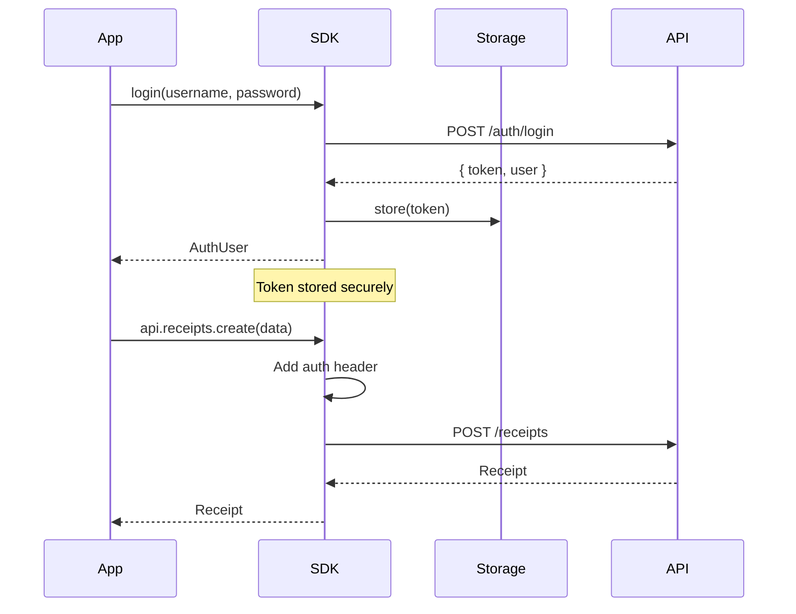
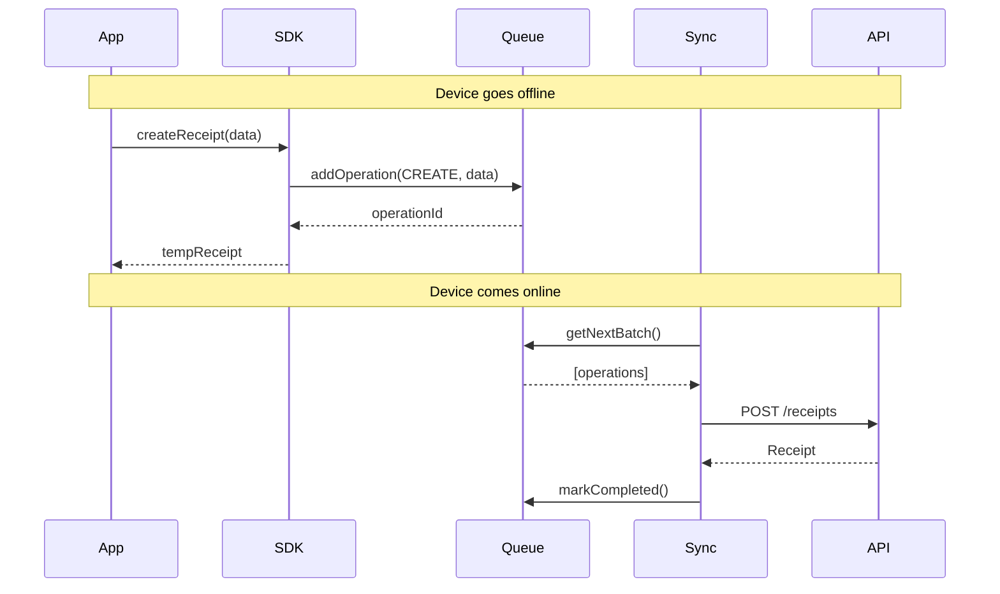

# ACube E-Receipt JavaScript SDK - API Documentation

[](https://npmjs.org/package/@a-cube-io/ereceipts-js-sdk)
[](https://github.com/a-cube-io/ereceipts-js-sdk/blob/master/LICENSE)
[](http://www.typescriptlang.org/)

**Enterprise-grade TypeScript SDK for ACube E-Receipt API integration with offline-first architecture and multi-platform support.**

---

## Table of Contents

1. [Introduction & Overview](#introduction--overview)
2. [Installation & Configuration](#installation--configuration)
3. [Architecture & Key Concepts](#architecture--key-concepts)
4. [API Reference](#api-reference)
5. [Platform Examples](#platform-examples)
6. [Best Practices](#best-practices)
7. [Security & Performance](#security--performance)
8. [Migration Guide](#migration-guide)
9. [Troubleshooting](#troubleshooting)

---

## Introduction & Overview

### What is ACube E-Receipt SDK?

The ACube E-Receipt JavaScript SDK is a comprehensive, enterprise-grade solution for integrating electronic receipt functionality into web, mobile, and server applications. Built with TypeScript and designed for reliability, it provides a unified API for managing electronic receipts, cashiers, point-of-sale systems, and offline synchronization.

### Key Features

- **🚀 Multi-Platform Support**: Web, Node.js, React Native, Expo
- **📱 Offline-First Architecture**: Queue-based synchronization with automatic retry
- **⚡ React Integration**: Context Provider and optimized hooks
- **🔐 Enterprise Security**: Secure token management and storage
- **🎯 TypeScript Support**: Full type definitions and IntelliSense
- **🌐 Cross-Platform Adapters**: Platform-specific implementations
- **📊 Real-time Sync**: Automatic online/offline detection and sync

### Supported Platforms

| Platform | Core SDK | React Hooks | Offline Support | Secure Storage |
|----------|----------|-------------|-----------------|----------------|
| **Web/PWA** | ✅ | ✅ | ✅ | ✅ (LocalStorage) |
| **Node.js** | ✅ | ❌ | ✅ | ✅ (File system) |
| **React Native** | ✅ | ✅ | ✅ | ✅ (Keychain/SecureStore) |
| **Expo** | ✅ | ✅ | ✅ | ✅ (expo-secure-store) |

### Architecture Overview

```
┌─────────────────────┐    ┌─────────────────────┐    ┌─────────────────────┐
│   User Interface    │    │    React Hooks      │    │   Platform Layer    │
│  (React/Native/Web) │◄──►│  (useAuth, etc.)    │◄──►│   (Adapters)        │
└─────────────────────┘    └─────────────────────┘    └─────────────────────┘
           │                          │                          │
           ▼                          ▼                          ▼
┌─────────────────────┐    ┌─────────────────────┐    ┌─────────────────────┐
│    ACube SDK        │    │    API Clients      │    │  Offline Manager    │
│   (Main Entry)      │◄──►│  (Receipts, etc.)   │◄──►│   (Queue & Sync)    │
└─────────────────────┘    └─────────────────────┘    └─────────────────────┘
           │                          │                          │
           ▼                          ▼                          ▼
┌─────────────────────────────────────────────────────────────────────────────┐
│                        ACube E-Receipt API                                  │
│                (https://ereceipts-it.acubeapi.com)                         │
└─────────────────────────────────────────────────────────────────────────────┘
```

---

## Installation & Configuration

### Package Installation

```bash
# npm
npm install @a-cube-io/ereceipts-js-sdk

# yarn
yarn add @a-cube-io/ereceipts-js-sdk

# pnpm
pnpm add @a-cube-io/ereceipts-js-sdk
```

### Platform-Specific Dependencies

#### React Native / Expo
```bash
# For storage support
npm install @react-native-async-storage/async-storage

# For secure storage (React Native)
npm install react-native-keychain

# For secure storage (Expo)
npm install expo-secure-store

# For network monitoring
npm install @react-native-community/netinfo
```

#### Web/PWA
No additional dependencies required. Uses built-in browser APIs.

#### Node.js
No additional dependencies required. Uses built-in filesystem APIs.

### Basic Setup

#### 1. Import the SDK

```typescript
// ES Modules
import { ACubeSDK, createACubeSDK } from '@a-cube-io/ereceipts-js-sdk';

// CommonJS
const { ACubeSDK, createACubeSDK } = require('@a-cube-io/ereceipts-js-sdk');

// React-specific imports
import { 
  ACubeProvider, 
  useAuth, 
  useReceipts, 
  useOffline 
} from '@a-cube-io/ereceipts-js-sdk/react';
```

#### 2. Initialize the SDK

```typescript
// Method 1: Using createACubeSDK (recommended)
const sdk = await createACubeSDK({
  environment: 'production', // 'production' | 'development' | 'sandbox'
  apiUrl: 'https://ereceipts-it.acubeapi.com', // optional, auto-detected
  authUrl: 'https://common.api.acubeapi.com', // optional, auto-detected
  timeout: 30000, // optional, default 30s
  retryAttempts: 3, // optional, default 3
  debug: false, // optional, default false
});

// Method 2: Manual initialization
const sdk = new ACubeSDK({
  environment: 'production',
});
await sdk.initialize();
```

#### 3. Authenticate

```typescript
// Login with credentials
const user = await sdk.login({
  email: 'cashier@example.com',
  password: 'password123'
});

// Or check stored authentication
const isAuthenticated = await sdk.isAuthenticated();
if (isAuthenticated) {
  const currentUser = await sdk.getCurrentUser();
}
```

---

## Architecture & Key Concepts

### Core Components

#### 1. **ACubeSDK Class**
The main entry point providing access to all SDK functionality.

```typescript
interface SDKConfig {
  environment: 'production' | 'development' | 'sandbox';
  apiUrl?: string;
  authUrl?: string;
  timeout?: number;
  retryAttempts?: number;
  debug?: boolean;
  customHeaders?: Record<string, string>;
}
```

#### 2. **API Clients**
Specialized managers for different resource types:

**MF1 APIs (Core E-Receipt Functionality):**
- **ReceiptsAPI**: Electronic receipt operations
- **CashiersAPI**: Cashier management  
- **PointOfSalesAPI**: PEM device management
- **CashRegistersAPI**: Cash register operations

**MF2 APIs (Advanced Management):**
- **MerchantsAPI**: Merchant management and configuration
- **PemsAPI**: Advanced PEM device management
- **SuppliersAPI**: Supplier management and fiscal data
- **DailyReportsAPI**: Daily fiscal report management
- **JournalsAPI**: Fiscal journal operations

#### 3. **Platform Adapters**
Abstract interfaces with platform-specific implementations:

```typescript
interface PlatformAdapters {
  storage: IStorage;           // Local data storage
  secureStorage: ISecureStorage; // Secure credential storage
  networkMonitor: INetworkMonitor; // Connectivity monitoring
}
```

#### 4. **Offline System**
Three-layer offline architecture:

- **OfflineManager**: High-level queue operations
- **OperationQueue**: FIFO queue with priority support
- **SyncManager**: Network-aware synchronization

### Authentication Flow



### Offline Operation Flow



---

## API Reference

### ACubeSDK Class

The main SDK class providing access to all functionality.

#### Constructor

```typescript
constructor(config: SDKConfig, customAdapters?: PlatformAdapters, events?: SDKEvents)
```

**Parameters:**
- `config: SDKConfig` - SDK configuration object
- `customAdapters?: PlatformAdapters` - Optional custom platform adapters
- `events?: SDKEvents` - Optional event handlers

**Example:**
```typescript
const sdk = new ACubeSDK({
  environment: 'production',
  debug: false,
});
```

#### Methods

##### `initialize(): Promise<void>`

Initializes the SDK, loads platform adapters, and sets up offline functionality.

**Returns:** `Promise<void>`

**Throws:** `ACubeSDKError` if initialization fails

**Example:**
```typescript
try {
  await sdk.initialize();
  console.log('SDK initialized successfully');
} catch (error) {
  console.error('Failed to initialize SDK:', error);
}
```

##### `isInitialized(): boolean`

Checks if the SDK has been initialized.

**Returns:** `boolean`

##### `getOfflineManager(): OfflineManager`

Returns the offline manager for manual queue operations.

**Returns:** `OfflineManager`

**Throws:** `ACubeSDKError` if SDK not initialized

##### `destroy(): void`

Cleans up resources and stops background processes.

**Example:**
```typescript
// Clean up when app closes
window.addEventListener('beforeunload', () => {
  sdk.destroy();
});
```

#### Properties

##### `api: APIClient`

API client providing access to all resource managers (available after initialization).

### APIClient Class

Central hub for accessing all API resources.

#### Properties

```typescript
class APIClient {
  // MF1 APIs
  readonly receipts: ReceiptsAPI;
  readonly cashiers: CashiersAPI;
  readonly pointOfSales: PointOfSalesAPI;
  readonly cashRegisters: CashRegistersAPI;
  
  // MF2 APIs
  readonly merchants: MerchantsAPI;
  readonly pems: PemsAPI;
  readonly suppliers: SuppliersAPI;
  readonly dailyReports: DailyReportsAPI;
  readonly journals: JournalsAPI;
}
```

### ReceiptsAPI Class

Manages electronic receipt operations with full offline support.

#### Methods

##### `create(receiptData: ReceiptInput): Promise<ReceiptOutput>`

Creates a new electronic receipt.

**Parameters:**
- `receiptData: ReceiptInput` - Receipt information

**Returns:** `Promise<ReceiptOutput>` - Created receipt

**Example:**
```typescript
const receipt = await sdk.api.receipts.create({
  items: [
    {
      description: 'Coffee',
      unit_price: '2.50',
      quantity: '1.00',
      vat_rate_code: '22'
    }
  ],
  cash_payment_amount: '2.50'
});
```

##### `list(params?: ListParams): Promise<Page<ReceiptOutput>>`

Retrieves a paginated list of receipts.

**Parameters:**
- `params?: ListParams` - Optional pagination parameters

**Returns:** `Promise<Page<ReceiptOutput>>` - Paginated receipt list

**Example:**
```typescript
const receipts = await sdk.api.receipts.list({
  page: 1,
  size: 20
});

console.log(`Found ${receipts.total} receipts`);
receipts.members.forEach(receipt => {
  console.log(`Receipt ${receipt.uuid}: ${receipt.total_amount}€`);
});
```

##### `get(receiptUuid: string): Promise<ReceiptOutput>`

Retrieves a specific receipt by UUID.

**Parameters:**
- `receiptUuid: string` - Receipt UUID

**Returns:** `Promise<ReceiptOutput>` - Receipt details

##### `getDetails(receiptUuid: string, format?: 'json' | 'pdf'): Promise<ReceiptDetailsOutput | Blob>`

Retrieves detailed receipt information or PDF.

**Parameters:**
- `receiptUuid: string` - Receipt UUID
- `format?: 'json' | 'pdf'` - Response format (default: 'json')

**Returns:** `Promise<ReceiptDetailsOutput | Blob>` - Receipt details or PDF blob

**Example:**
```typescript
// Get JSON details
const details = await sdk.api.receipts.getDetails(receiptUuid, 'json');

// Get PDF blob
const pdfBlob = await sdk.api.receipts.getDetails(receiptUuid, 'pdf');
const url = URL.createObjectURL(pdfBlob);
window.open(url); // Open PDF in new tab
```

##### `void(voidData: ReceiptReturnOrVoidViaPEMInput): Promise<void>`

Voids an electronic receipt via PEM device.

**Parameters:**
- `voidData: ReceiptReturnOrVoidViaPEMInput` - Void information

**Example:**
```typescript
await sdk.api.receipts.void({
  pem_id: 'pem-id',
  items: [],
  document_number: '123',
  document_date: '2024-01-15'
});
```

##### `voidWithProof(voidData: ReceiptReturnOrVoidWithProofInput): Promise<void>`

Voids an electronic receipt identified by proof of purchase.

**Parameters:**
- `voidData: ReceiptReturnOrVoidWithProofInput` - Void with proof information

**Example:**
```typescript
await sdk.api.receipts.voidWithProof({
  items: [],
  proof: 'POS',
  document_datetime: '2024-01-15T10:30:00Z'
});
```

##### `return(returnData: ReceiptReturnOrVoidViaPEMInput): Promise<ReceiptOutput>`

Processes a return for items from an electronic receipt via PEM device.

**Parameters:**
- `returnData: ReceiptReturnOrVoidViaPEMInput` - Return information

**Returns:** `Promise<ReceiptOutput>` - Return receipt

##### `returnWithProof(returnData: ReceiptReturnOrVoidWithProofInput): Promise<ReceiptOutput>`

Processes a return for items from an electronic receipt identified by proof of purchase.

**Parameters:**
- `returnData: ReceiptReturnOrVoidWithProofInput` - Return with proof information

**Returns:** `Promise<ReceiptOutput>` - Return receipt

### Authentication Methods

The SDK provides built-in authentication methods accessible directly on the main SDK instance.

#### Methods

##### `login(credentials: AuthCredentials): Promise<User>`

Authenticates user with credentials.

**Parameters:**
- `credentials: AuthCredentials` - User credentials object with email and password

**Returns:** `Promise<User>` - Authenticated user information

**Throws:** `ACubeSDKError` on authentication failure

**Example:**
```typescript
const user = await sdk.login({
  email: 'cashier@example.com',
  password: 'password123'
});
```

##### `logout(): Promise<void>`

Logs out current user and clears stored credentials.

**Returns:** `Promise<void>`

##### `isAuthenticated(): Promise<boolean>`

Checks if user is currently authenticated.

**Returns:** `Promise<boolean>` - Authentication status

##### `getCurrentUser(): Promise<User | null>`

Returns current authenticated user information.

**Returns:** `Promise<User | null>` - Current user or null

### SuppliersAPI Class

Manages supplier information for invoice and receipt processing (MF2 API).

#### Methods

##### `list(params: SuppliersParams): Promise<SupplierOutput[]>`
Retrieves a list of suppliers.

**Parameters:**
- `params: SuppliersParams` - List parameters including pagination

**Example:**
```typescript
const suppliers = await sdk.api.suppliers.list({
  page: 1
});
```

##### `create(supplierData: SupplierCreateInput): Promise<SupplierOutput>`
Creates a new supplier.

**Parameters:**
- `supplierData: SupplierCreateInput` - Supplier data including fiscal_id and name

**Example:**
```typescript
const supplier = await sdk.api.suppliers.create({
  fiscal_id: '12345678901',
  name: 'Acme Supplier Corp',
  address: {
    street_address: 'Via Roma 123',
    street_number: '123',
    zip_code: '00100',
    city: 'Roma',
    province: 'RM'
  }
});
```

### DailyReportsAPI Class

Manages daily fiscal reports and transmissions to tax authorities (MF2 API).

#### Methods

##### `list(params: DailyReportsParams): Promise<DailyReportOutput[]>`
Retrieves daily reports with filtering options.

**Parameters:**
- `params: DailyReportsParams` - Filter parameters including date range and status

**Example:**
```typescript
const reports = await sdk.api.dailyReports.list({
  pem_serial_number: 'PEM123456',
  status: 'pending',
  date_from: '2024-01-01',
  date_to: '2024-01-31'
});
```

##### `regenerate(uuid: string): Promise<DailyReportOutput>`
Regenerates and retransmits a failed daily report.

**Example:**
```typescript
const regenerated = await sdk.api.dailyReports.regenerate(reportUuid);
```

### JournalsAPI Class

Manages fiscal journal operations and closures (MF2 API).

#### Methods

##### `list(params: JournalsParams): Promise<JournalOutput[]>`
Retrieves journals with filtering options.

**Example:**
```typescript
const journals = await sdk.api.journals.list({
  pem_serial_number: 'PEM123456',
  status: 'open'
});
```

##### `close(uuid: string, closeData: JournalCloseInput): Promise<JournalOutput>`
Closes a fiscal journal.

**Example:**
```typescript
const closedJournal = await sdk.api.journals.close(journalUuid, {
  closing_timestamp: new Date().toISOString(),
  reason: 'End of business day'
});
```

### OfflineManager Class

Manages offline operations and synchronization.

#### Methods

##### `queueReceiptCreation(receiptData: any, priority?: number): Promise<string>`

Queues a receipt creation for offline processing.

**Parameters:**
- `receiptData: any` - Receipt data
- `priority?: number` - Operation priority (default: 2)

**Returns:** `Promise<string>` - Operation ID

##### `queueReceiptVoid(voidData: any, priority?: number): Promise<string>`

Queues a receipt void operation.

**Parameters:**
- `voidData: any` - Void data
- `priority?: number` - Operation priority (default: 3)

**Returns:** `Promise<string>` - Operation ID

##### `sync(): Promise<BatchSyncResult | null>`

Manually triggers synchronization of pending operations.

**Returns:** `Promise<BatchSyncResult | null>` - Sync results or null if offline

##### `getStatus(): SyncStatus`

Returns current sync status and queue statistics.

**Returns:** `SyncStatus` - Current status

**Example:**
```typescript
const status = sdk.getOfflineManager().getStatus();
console.log(`Queue: ${status.queueStats.pending} pending, ${status.queueStats.failed} failed`);
console.log(`Online: ${status.isOnline}, Syncing: ${status.isProcessing}`);
```

##### `retryFailed(): Promise<void>`

Retries all failed operations.

**Returns:** `Promise<void>`

---

## Platform Examples

### Web/PWA Implementation

```typescript
// main.ts
import { createACubeSDK } from '@a-cube-io/ereceipts-js-sdk';

const sdk = await createACubeSDK({
  environment: 'production',
});

async function initializeApp() {
  try {
    // Check authentication
    if (await sdk.isAuthenticated()) {
      loadDashboard();
    } else {
      showLoginForm();
    }
  } catch (error) {
    console.error('Failed to initialize:', error);
  }
}

async function createReceipt(items: any[]) {
  try {
    const receipt = await sdk.api.receipts.create({
      items,
      cash_payment_amount: '10.00'
    });
    
    console.log('Receipt created:', receipt.uuid);
    return receipt;
  } catch (error) {
    console.error('Failed to create receipt:', error);
    throw error;
  }
}

// Initialize on page load
document.addEventListener('DOMContentLoaded', initializeApp);
```

### React Implementation

```tsx
// App.tsx
import React from 'react';
import { ACubeProvider } from '@a-cube-io/ereceipts-js-sdk/react';

const config = {
  environment: 'production' as const,
};

function App() {
  return (
    <ACubeProvider config={config}>
      <Dashboard />
    </ACubeProvider>
  );
}

// Dashboard.tsx
import React from 'react';
import { useAuth, useReceipts } from '@a-cube-io/ereceipts-js-sdk/react';

function Dashboard() {
  const { user, login, logout } = useAuth();
  const { receipts, createReceipt, isLoading } = useReceipts();

  const handleCreateReceipt = async () => {
    try {
      await createReceipt({
        items: [
          {
            description: 'Coffee',
            unit_price: '2.50',
            quantity: '1.00',
            vat_rate_code: '22'
          }
        ],
        cash_payment_amount: '2.50'
      });
    } catch (error) {
      console.error('Failed to create receipt:', error);
    }
  };

  const handleLogin = async () => {
    await login({
      email: 'cashier@example.com',
      password: 'password123'
    });
  };

  if (!user) {
    return <button onClick={handleLogin}>Login</button>;
  }

  return (
    <div>
      <h1>Welcome, {user.email}</h1>
      <button onClick={handleCreateReceipt} disabled={isLoading}>
        Create Receipt
      </button>
      
      <div>
        <h2>Recent Receipts</h2>
        {receipts.map(receipt => (
          <div key={receipt.uuid}>
            Receipt: {receipt.total_amount}€
          </div>
        ))}
      </div>
      
      <button onClick={logout}>Logout</button>
    </div>
  );
}
```

### React Native/Expo Implementation

```tsx
// App.tsx
import React from 'react';
import { SafeAreaProvider } from 'react-native-safe-area-context';
import { ACubeProvider } from '@a-cube-io/ereceipts-js-sdk/react';

const config = {
  environment: 'production' as const,
};

export default function App() {
  return (
    <SafeAreaProvider>
      <ACubeProvider config={config}>
        <MainNavigator />
      </ACubeProvider>
    </SafeAreaProvider>
  );
}

// ReceiptScreen.tsx
import React, { useState } from 'react';
import { View, Text, Button, Alert } from 'react-native';
import { useReceipts, useOffline } from '@a-cube-io/ereceipts-js-sdk/react';

export function ReceiptScreen() {
  const { createReceipt, isLoading } = useReceipts();
  const { isOnline, pendingCount } = useOffline();

  const handleCreateReceipt = async () => {
    try {
      const receipt = await createReceipt({
        items: [
          {
            description: 'Mobile Sale',
            unit_price: '10.00',
            quantity: '1.00',
            vat_rate_code: '22'
          }
        ],
        cash_payment_amount: '10.00'
      });

      Alert.alert(
        'Success', 
        isOnline 
          ? `Receipt created: ${receipt.uuid}`
          : 'Receipt queued for sync when online'
      );
    } catch (error) {
      Alert.alert('Error', 'Failed to create receipt');
    }
  };

  return (
    <View style={{ flex: 1, padding: 20 }}>
      <Text>Status: {isOnline ? 'Online' : 'Offline'}</Text>
      {pendingCount > 0 && (
        <Text>Pending operations: {pendingCount}</Text>
      )}
      
      <Button
        title={isLoading ? 'Creating...' : 'Create Receipt'}
        onPress={handleCreateReceipt}
        disabled={isLoading}
      />
    </View>
  );
}
```

### Node.js Implementation

```typescript
// server.ts
import { createACubeSDK } from '@a-cube-io/ereceipts-js-sdk';
import express from 'express';

const app = express();
app.use(express.json());

// Initialize SDK
async function initializeServer() {
  try {
    const sdk = await createACubeSDK({
      environment: 'production',
    });
    
    console.log('ACube SDK initialized');
    
    // API endpoint for creating receipts
    app.post('/api/receipts', async (req, res) => {
      try {
        // Authenticate with user credentials
        await sdk.login({
          email: req.body.email,
          password: req.body.password
        });
        
        // Create receipt
        const receipt = await sdk.api.receipts.create(req.body.receiptData);
        
        res.json(receipt);
      } catch (error) {
        console.error('Error creating receipt:', error);
        res.status(500).json({ error: error.message });
      }
    });
    
    // Graceful shutdown
    process.on('SIGTERM', () => {
      sdk.destroy();
      process.exit(0);
    });
    
    // Start server
    app.listen(3000, () => {
      console.log('Server running on port 3000');
    });
  } catch (error) {
    console.error('Failed to initialize SDK:', error);
    process.exit(1);
  }
}

initializeServer();
```

---

## Best Practices

### Authentication & Security

#### 1. **Secure API Key Storage**

```typescript
// ✅ Use environment variables
const sdk = await createACubeSDK({
  environment: process.env.NODE_ENV === 'production' ? 'production' : 'sandbox'
});

// ✅ Configuration per environment
const config = {
  production: { environment: 'production' as const },
  development: { environment: 'development' as const },
  test: { environment: 'sandbox' as const }
};

const sdk = await createACubeSDK(config[process.env.NODE_ENV || 'development']);
```

#### 2. **Token Management**

```typescript
// ✅ Check authentication before API calls
if (await sdk.isAuthenticated()) {
  const receipts = await sdk.api.receipts.list();
} else {
  // Redirect to login
  redirectToLogin();
}

// ✅ Handle authentication errors
try {
  await sdk.api.receipts.create(data);
} catch (error) {
  if (error.type === 'AUTH_ERROR') {
    // Token expired, redirect to login
    await sdk.logout();
    redirectToLogin();
  }
}
```

### Offline Operations

#### 1. **Optimistic UI Updates**

```tsx
// ✅ Provide immediate feedback
const { createReceipt } = useReceipts();

const handleCreate = async (data) => {
  // Show optimistic update
  setReceipts(prev => [tempReceipt, ...prev]);
  
  try {
    const receipt = await createReceipt(data);
    // Update with real receipt
    setReceipts(prev => prev.map(r => 
      r.uuid === tempReceipt.uuid ? receipt : r
    ));
  } catch (error) {
    // Revert optimistic update
    setReceipts(prev => prev.filter(r => r.uuid !== tempReceipt.uuid));
    showError(error);
  }
};
```

#### 2. **Queue Management**

```typescript
// ✅ Monitor queue status
const offlineManager = sdk.getOfflineManager();

// Check queue periodically
setInterval(async () => {
  const status = offlineManager.getStatus();
  
  if (status.queueStats.failed > 0) {
    // Show retry option to user
    showRetryPrompt(() => offlineManager.retryFailed());
  }
  
  if (status.queueStats.pending > 10) {
    // Warn about large queue
    showQueueWarning(status.queueStats.pending);
  }
}, 10000);
```

### Error Handling

#### 1. **Comprehensive Error Handling**

```typescript
// ✅ Handle different error types
try {
  await sdk.api.receipts.create(data);
} catch (error) {
  switch (error.code) {
    case 'NETWORK_ERROR':
      showNotification('Network issue. Receipt will be synced when online.');
      break;
    case 'VALIDATION_ERROR':
      showValidationErrors(error.details);
      break;
    case 'AUTHENTICATION_ERROR':
      redirectToLogin();
      break;
    default:
      showGenericError(error.message);
  }
}
```

#### 2. **Retry Strategies**

```typescript
// ✅ Implement exponential backoff for retries
async function createReceiptWithRetry(data: ReceiptInput, maxRetries = 3) {
  let attempt = 0;
  
  while (attempt < maxRetries) {
    try {
      return await sdk.api.receipts.create(data);
    } catch (error) {
      attempt++;
      
      if (attempt >= maxRetries || !isRetryableError(error)) {
        throw error;
      }
      
      // Exponential backoff
      const delay = Math.pow(2, attempt) * 1000;
      await new Promise(resolve => setTimeout(resolve, delay));
    }
  }
}
```

### Performance Optimization

#### 1. **Efficient Data Loading**

```typescript
// ✅ Use pagination for large datasets
const loadReceipts = async (page = 1) => {
  const receipts = await sdk.api.receipts.list({
    page,
    size: 20 // Reasonable page size
  });
  
  return receipts;
};

// ✅ Implement virtual scrolling for large lists
const VirtualReceiptList = () => {
  const [receipts, setReceipts] = useState([]);
  
  const loadMore = useCallback(async () => {
    const nextPage = Math.ceil(receipts.length / 20) + 1;
    const newReceipts = await loadReceipts(nextPage);
    setReceipts(prev => [...prev, ...newReceipts.content]);
  }, [receipts.length]);
  
  return (
    <VirtualizedList
      data={receipts}
      renderItem={ReceiptItem}
      onEndReached={loadMore}
    />
  );
};
```

#### 2. **Memory Management**

```typescript
// ✅ Clean up resources
useEffect(() => {
  return () => {
    // Clean up SDK resources
    sdk.destroy();
  };
}, []);

// ✅ Limit cache size
const offlineConfig = {
  maxQueueSize: 1000, // Limit queue size
  syncInterval: 30000, // Regular cleanup
};
```

### Cross-Platform Compatibility

#### 1. **Platform Detection**

```typescript
// ✅ Conditional feature usage
import { Platform } from 'react-native';

const useNativeFeatures = Platform.OS !== 'web';

if (useNativeFeatures) {
  // Use device-specific features
  await Notifications.scheduleNotificationAsync({
    content: { title: 'Receipt synced' }
  });
}
```

#### 2. **Graceful Degradation**

```typescript
// ✅ Fallback for unsupported features
const saveToSecureStorage = async (key: string, value: string) => {
  try {
    // Try secure storage first
    await SecureStore.setItemAsync(key, value);
  } catch (error) {
    // Fallback to regular storage with warning
    console.warn('Secure storage unavailable, using regular storage');
    localStorage.setItem(key, value);
  }
};
```

---

## Security & Performance

### Security Best Practices

#### 1. **Data Protection**

- **Never log sensitive data** in production
- **Use HTTPS only** for API communications
- **Implement certificate pinning** in mobile apps
- **Rotate API keys** regularly
- **Use secure storage** for tokens and credentials

```typescript
// ✅ Security configuration
const sdk = await createACubeSDK({
  environment: 'production',
  timeout: 30000,
  debug: false, // Disable debug in production
  customHeaders: {
    'User-Agent': 'MyApp/1.0.0'
  }
});
```

#### 2. **Token Security**

```typescript
// ✅ Secure token handling
class SecureTokenManager {
  async storeToken(token: string) {
    // Use secure storage with encryption
    await SecureStore.setItemAsync('auth_token', token, {
      keychainService: 'acube-sdk',
      encrypt: true,
    });
  }
  
  async getToken(): Promise<string | null> {
    try {
      return await SecureStore.getItemAsync('auth_token');
    } catch (error) {
      console.warn('Failed to retrieve token:', error);
      return null;
    }
  }
  
  async clearToken() {
    await SecureStore.deleteItemAsync('auth_token');
  }
}
```

### Performance Optimization

#### 1. **Bundle Size Optimization**

```typescript
// ✅ Tree-shaking friendly imports
import { ACubeSDK, createACubeSDK } from '@a-cube-io/ereceipts-js-sdk';
import { useReceipts } from '@a-cube-io/ereceipts-js-sdk/react';

// ❌ Avoid importing entire library
import * as ACube from '@a-cube-io/ereceipts-js-sdk';
```

#### 2. **Request Optimization**

```typescript
// ✅ Batch operations when possible
const batchCreateReceipts = async (receipts: ReceiptInput[]) => {
  // Use offline manager for batch operations
  const offlineManager = sdk.getOfflineManager();
  
  const operationIds = await Promise.all(
    receipts.map(receipt => 
      offlineManager.queueReceiptCreation(receipt, 2)
    )
  );
  
  // Trigger batch sync
  if (sdk.isOnline()) {
    await offlineManager.sync();
  }
  
  return operationIds;
};
```

#### 3. **Memory Management**

```typescript
// ✅ Efficient data structures
interface OptimizedReceiptCache {
  receipts: Map<string, ReceiptOutput>; // Use Map for O(1) lookups
  index: string[]; // Maintain order separately
  maxSize: number;
}

class ReceiptCache {
  private cache: OptimizedReceiptCache;
  
  add(receipt: ReceiptOutput) {
    if (this.cache.index.length >= this.cache.maxSize) {
      // Remove oldest entry
      const oldestId = this.cache.index.shift()!;
      this.cache.receipts.delete(oldestId);
    }
    
    this.cache.receipts.set(receipt.uuid, receipt);
    this.cache.index.push(receipt.uuid);
  }
  
  get(uuid: string): ReceiptOutput | undefined {
    return this.cache.receipts.get(uuid);
  }
}
```

### Monitoring & Analytics

#### 1. **Performance Monitoring**

```typescript
// ✅ Performance tracking
class PerformanceMonitor {
  private metrics: Map<string, number> = new Map();
  
  async trackOperation<T>(
    operation: string, 
    fn: () => Promise<T>
  ): Promise<T> {
    const start = performance.now();
    
    try {
      const result = await fn();
      const duration = performance.now() - start;
      
      this.metrics.set(operation, duration);
      
      // Log slow operations
      if (duration > 2000) {
        console.warn(`Slow operation: ${operation} took ${duration}ms`);
      }
      
      return result;
    } catch (error) {
      const duration = performance.now() - start;
      console.error(`Failed operation: ${operation} failed after ${duration}ms`, error);
      throw error;
    }
  }
  
  getMetrics() {
    return Object.fromEntries(this.metrics);
  }
}

// Usage
const monitor = new PerformanceMonitor();

const receipt = await monitor.trackOperation('receipt_creation', () =>
  sdk.api.receipts.create(data)
);
```

#### 2. **Error Tracking**

```typescript
// ✅ Comprehensive error tracking
class ErrorTracker {
  private errors: Array<{ 
    timestamp: Date; 
    error: Error; 
    context: any 
  }> = [];
  
  track(error: Error, context: any = {}) {
    this.errors.push({
      timestamp: new Date(),
      error,
      context
    });
    
    // Send to analytics service
    if (typeof window !== 'undefined' && window.gtag) {
      window.gtag('event', 'exception', {
        description: error.message,
        fatal: false,
        custom_map: context
      });
    }
  }
  
  getErrorReport() {
    return {
      totalErrors: this.errors.length,
      recentErrors: this.errors.slice(-10),
      errorsByType: this.groupErrorsByType()
    };
  }
  
  private groupErrorsByType() {
    const groups: Record<string, number> = {};
    
    this.errors.forEach(({ error }) => {
      const type = error.constructor.name;
      groups[type] = (groups[type] || 0) + 1;
    });
    
    return groups;
  }
}
```

---

## Migration Guide

### From Version 0.x to 1.x

#### Breaking Changes

1. **Configuration Structure**
```typescript
// ❌ Old configuration (v0.x)
const sdk = new ACubeSDK('api-key', {
  environment: 'production'
});

// ✅ New configuration (v1.x)
const sdk = await createACubeSDK({
  environment: 'production'
});
```

2. **Authentication Methods**
```typescript
// ❌ Old authentication (v0.x)
await sdk.authenticate('username', 'password');

// ✅ New authentication (v1.x)
await sdk.login({
  email: 'user@example.com',
  password: 'password'
});
```

3. **API Access**
```typescript
// ❌ Old API access (v0.x)
const receipt = await sdk.createReceipt(data);

// ✅ New API access (v1.x)
const receipt = await sdk.api.receipts.create(data);
```

#### Migration Steps

1. **Update Configuration**
```typescript
// Step 1: Update SDK initialization
const oldSdk = new ACubeSDK('api-key', options);
const newSdk = await createACubeSDK({ environment: 'production', ...options });
```

2. **Update Authentication Calls**
```typescript
// Step 1: Replace authenticate calls
// await sdk.authenticate(username, password);
await sdk.login({ email: username, password });

// Step 2: Update session checks
// const isAuth = sdk.isAuthenticated();
const isAuth = await sdk.isAuthenticated();
```

3. **Update API Calls**
```typescript
// Step 1: Update receipt operations
// const receipt = await sdk.createReceipt(data);
const receipt = await sdk.api.receipts.create(data);

// const receipts = await sdk.getReceipts();
const receipts = await sdk.api.receipts.list();

// Step 2: Update other resource operations
// const cashier = await sdk.createCashier(data);
const cashier = await sdk.api.cashiers.create(data);
```

### Migration Checklist

- [ ] Update SDK initialization
- [ ] Replace authentication method calls
- [ ] Update all API method calls
- [ ] Test offline functionality
- [ ] Update error handling for new error types
- [ ] Verify platform-specific implementations
- [ ] Update React hook usage (if applicable)
- [ ] Test all critical user flows

---

## Troubleshooting

### Common Issues

#### 1. **SDK Initialization Fails**

**Problem:** SDK throws error during `initialize()`

**Causes & Solutions:**
```typescript
// ❌ Missing API key
const sdk = new ACubeSDK({
  environment: 'production'
  // Missing apiKey
});

// ✅ Solution: Provide API key
const sdk = new ACubeSDK({
  environment: 'production',
  apiKey: process.env.ACUBE_API_KEY!
});

// ❌ Platform adapters not available
// In React Native without required dependencies

// ✅ Solution: Install required dependencies
// npm install @react-native-async-storage/async-storage
// npm install expo-secure-store  # or react-native-keychain
```

#### 2. **Authentication Issues**

**Problem:** `AUTHENTICATION_ERROR` or token-related issues

**Diagnosis:**
```typescript
// Check authentication status
const isAuth = await sdk.auth.isAuthenticated();
console.log('Authenticated:', isAuth);

// Check current user
const user = await sdk.auth.getCurrentUser();
console.log('Current user:', user);

// Check token validity
try {
  await sdk.api.receipts.list({ size: 1 });
  console.log('Token valid');
} catch (error) {
  console.log('Token invalid:', error.code);
}
```

**Solutions:**
```typescript
// ✅ Refresh token
try {
  await sdk.auth.refreshToken();
} catch (error) {
  // Token cannot be refreshed, re-login required
  await sdk.auth.logout();
  // Redirect to login
}

// ✅ Handle authentication in API calls
const makeAuthenticatedRequest = async (fn) => {
  try {
    return await fn();
  } catch (error) {
    if (error.code === 'AUTHENTICATION_ERROR') {
      await sdk.auth.logout();
      throw new Error('Please log in again');
    }
    throw error;
  }
};
```

#### 3. **Offline Sync Issues**

**Problem:** Operations not syncing when back online

**Diagnosis:**
```typescript
// Check offline manager status
const status = sdk.getOfflineManager().getStatus();
console.log('Sync status:', status);

// Check queue contents
const stats = sdk.getOfflineManager().getQueueStats();
console.log('Queue stats:', stats);

// Check network status
console.log('Online:', sdk.isOnline());
```

**Solutions:**
```typescript
// ✅ Manual sync trigger
if (sdk.isOnline() && stats.pending > 0) {
  try {
    const result = await sdk.getOfflineManager().sync();
    console.log('Sync result:', result);
  } catch (error) {
    console.error('Sync failed:', error);
  }
}

// ✅ Retry failed operations
if (stats.failed > 0) {
  await sdk.getOfflineManager().retryFailed();
}

// ✅ Clear stuck operations
if (stats.failed > 10) {
  // Too many failures, might need manual intervention
  await sdk.getOfflineManager().clearFailed();
}
```

#### 4. **React Native Bundle Issues**

**Problem:** Metro bundler errors with dynamic imports

**Solution:** Ensure static imports are used in platform adapters

```typescript
// ✅ Check if using correct imports
// The SDK should use require() instead of import() in platform adapters

// If still having issues, create metro.config.js:
const { getDefaultConfig } = require('@expo/metro-config');

const config = getDefaultConfig(__dirname);
config.resolver.platforms = ['native', 'react-native', 'ios', 'android'];

module.exports = config;
```

#### 5. **Type Errors**

**Problem:** TypeScript compilation errors

**Solutions:**
```typescript
// ✅ Ensure proper type imports
import type { 
  ReceiptInput, 
  ReceiptOutput, 
  SDKConfig 
} from '@a-cube-io/ereceipts-js-sdk';

// ✅ Enable strict type checking in tsconfig.json
{
  "compilerOptions": {
    "strict": true,
    "noImplicitAny": true,
    "noImplicitReturns": true
  }
}

// ✅ Use proper type assertions
const config: SDKConfig = {
  environment: 'production' as const, // Use const assertion
};
```

### Debug Mode

Enable debug logging for troubleshooting:

```typescript
// Enable debug mode
const sdk = await createACubeSDK({
  environment: 'sandbox', // Use sandbox for testing
  debug: true, // Enable detailed logging
});

// Monitor SDK events (if using manual initialization)
const sdk = new ACubeSDK({
  environment: 'sandbox',
  debug: true
}, undefined, {
  onAuthError: (error) => {
    console.error('Auth Error:', error);
  },
  onUserChanged: (user) => {
    console.log('User changed:', user);
  },
  onNetworkStatusChanged: (online) => {
    console.log('Network status:', online ? 'Online' : 'Offline');
  },
  onOfflineOperationAdded: (operationId) => {
    console.log('Offline operation queued:', operationId);
  },
  onOfflineOperationCompleted: (operationId, success) => {
    console.log('Operation completed:', operationId, success);
  }
});
await sdk.initialize();
```

### Support Resources

- **Documentation**: [https://docs.acube.it/sdk](https://docs.acube.it/sdk)
- **API Reference**: [https://ereceipts-it.acubeapi.com/docs](https://ereceipts-it.acubeapi.com/docs)
- **GitHub Issues**: [https://github.com/a-cube-io/ereceipts-js-sdk/issues](https://github.com/a-cube-io/ereceipts-js-sdk/issues)
- **Community Forum**: [https://community.acube.it](https://community.acube.it)

---

## Appendix

### Type Definitions

#### Core Types

```typescript
// Configuration
interface SDKConfig {
  environment: 'production' | 'development' | 'sandbox';
  apiUrl?: string;
  authUrl?: string;
  timeout?: number;
  retryAttempts?: number;
  debug?: boolean;
  customHeaders?: Record<string, string>;
}

// Authentication
interface AuthCredentials {
  email: string;
  password: string;
}

interface User {
  id: string;
  email: string;
  username: string;
  roles: Record<string, string[]>;
  fid: string;
  pid: string | null;
}

// Receipts
interface ReceiptItem {
  good_or_service?: 'B' | 'S';
  quantity: string;
  description: string;
  unit_price: string;
  vat_rate_code?: VatRateCode;
  simplified_vat_allocation?: boolean;
  discount?: string;
  is_down_payment_or_voucher_redemption?: boolean;
  complimentary?: boolean;
}

interface ReceiptInput {
  items: ReceiptItem[];
  customer_tax_code?: string;
  customer_lottery_code?: string;
  discount?: string;
  invoice_issuing?: boolean;
  uncollected_dcr_to_ssn?: boolean;
  services_uncollected_amount?: string;
  goods_uncollected_amount?: string;
  cash_payment_amount?: string;
  electronic_payment_amount?: string;
  ticket_restaurant_payment_amount?: string;
  ticket_restaurant_quantity?: number;
}

interface ReceiptOutput {
  uuid: string;
  type: 'sale' | 'return' | 'void';
  customer_lottery_code?: string;
  created_at: string;
  total_amount: string;
  document_number?: string;
  document_datetime?: string;
}

// Pagination
interface Page<T> {
  members: T[];
  total?: number;
  page?: number;
  size?: number;
  pages?: number;
}

// VAT Rate Codes
type VatRateCode = '4' | '5' | '10' | '22' | '2' | '6.4' | '7' | '7.3' | '7.5' | '7.65' | '7.95' | '8.3' | '8.5' | '8.8' | '9.5' | '12.3' | 'N1' | 'N2' | 'N3' | 'N4' | 'N5' | 'N6';
```

### Error Codes

| Code | Description | Resolution |
|------|-------------|------------|
| `NETWORK_ERROR` | Network connectivity issue | Check internet connection |
| `AUTH_ERROR` | Invalid or expired credentials | Re-authenticate user |
| `VALIDATION_ERROR` | Invalid request data | Check input parameters |
| `NOT_FOUND_ERROR` | Resource not found | Verify resource exists |
| `FORBIDDEN_ERROR` | Insufficient permissions | Verify user roles |
| `UNKNOWN_ERROR` | Internal or unknown error | Retry or contact support |

---

**© 2024 A-Cube S.r.l. All rights reserved.**

*This documentation is version 1.0.0 of the ACube E-Receipt JavaScript SDK. For the most up-to-date information, please refer to the official documentation at [https://docs.acube.it](https://docs.acube.it).*