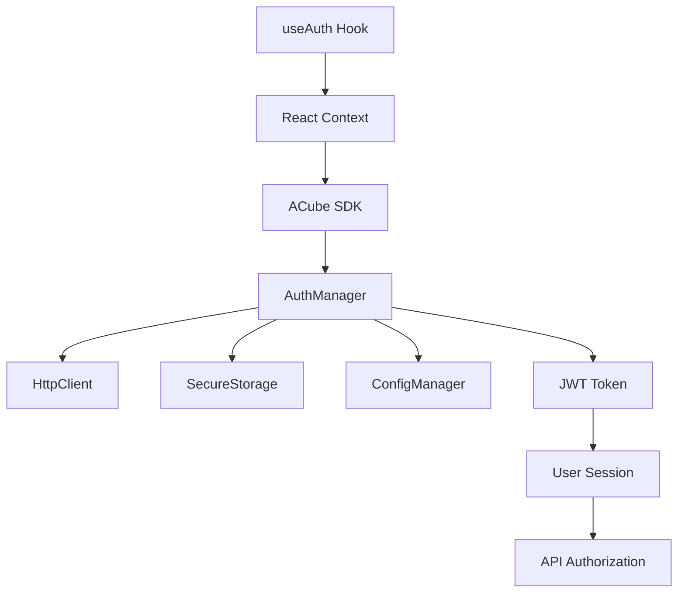
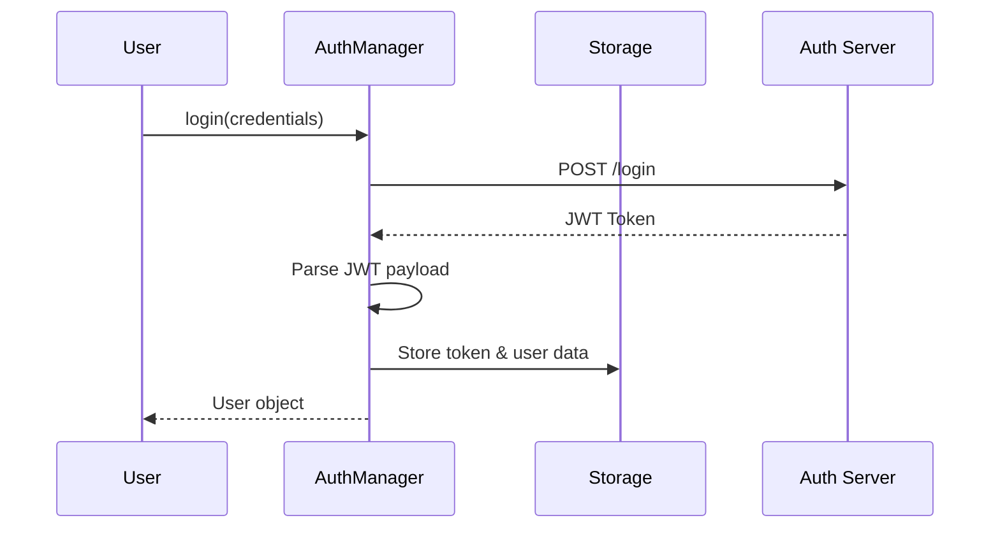
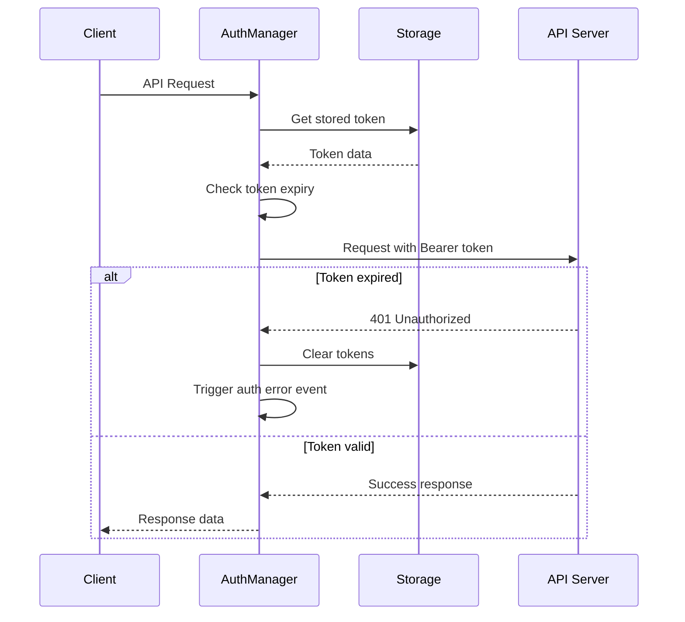

# ACube E-Receipt SDK - Authentication API Documentation

## Table of Contents

1. [Overview](#overview)
2. [Architecture](#architecture)
3. [Authentication Flow](#authentication-flow)
4. [Core API Reference](#core-api-reference)
5. [React Integration](#react-integration)
6. [Security Features](#security-features)
7. [Error Handling](#error-handling)
8. [Code Examples](#code-examples)
9. [Best Practices](#best-practices)
10. [Troubleshooting](#troubleshooting)

---

## Overview

The ACube E-Receipt SDK provides a comprehensive authentication system built on JWT (JSON Web Tokens) with secure token storage and automatic session management. The authentication system supports multiple platforms (Web, Node.js, React Native, Expo) with consistent API interfaces.

### Key Features

- 🔐 **JWT-based Authentication** - Secure token-based authentication
- 🔄 **Automatic Token Refresh** - Seamless session management
- 💾 **Secure Storage** - Platform-specific secure token storage
- ⚛️ **React Integration** - Ready-to-use hooks and context providers
- 🚨 **Error Handling** - Comprehensive error types and recovery mechanisms
- 🌐 **Multi-platform Support** - Works across all supported platforms
- 🔍 **Debug Support** - Built-in debugging and logging capabilities

---

## Architecture

### Core Components



### Component Responsibilities

| Component | Responsibility |
|-----------|----------------|
| **AuthManager** | Core authentication logic, token management, user session |
| **HttpClient** | HTTP requests with automatic token injection |
| **SecureStorage** | Platform-specific secure token storage |
| **ConfigManager** | Authentication endpoints and configuration |
| **React Context** | State management for React applications |
| **useAuth Hook** | React hook for authentication operations |

---

## Authentication Flow

### Login Flow



### Automatic Authorization Flow



---

## Core API Reference

### AuthManager Class

The core authentication manager that handles all authentication operations.

#### Constructor

```typescript
constructor(
  config: ConfigManager,
  secureStorage: ISecureStorage,
  events?: AuthEvents
)
```

**Parameters:**
- `config`: Configuration manager instance
- `secureStorage`: Platform-specific secure storage implementation
- `events`: Optional event handlers for authentication events

#### Methods

##### `login(credentials: AuthCredentials): Promise<User>`

Authenticates a user with email and password.

**Parameters:**
```typescript
interface AuthCredentials {
  email: string;
  password: string;
}
```

**Returns:**
```typescript
interface User {
  id: string;
  email: string;
  username: string;
  roles: Record<string, string[]>;
  fid: string;          // Fiscal ID
  pid: string | null;   // PEM ID
}
```

**Example:**
```typescript
const user = await authManager.login({
  email: 'user@example.com',
  password: 'securePassword123'
});
console.log('Logged in as:', user.email);
```

**Errors:**
- `AUTH_ERROR`: Invalid credentials or authentication failure
- `NETWORK_ERROR`: Network connectivity issues
- `VALIDATION_ERROR`: Invalid input format

##### `logout(): Promise<void>`

Logs out the current user and clears all stored authentication data.

**Example:**
```typescript
await authManager.logout();
console.log('User logged out successfully');
```

##### `getCurrentUser(): Promise<User>`

Retrieves the current authenticated user information.

**Returns:** `Promise<User>` - Current user data
**Throws:** `AUTH_ERROR` if no valid authentication found

**Example:**
```typescript
try {
  const user = await authManager.getCurrentUser();
  console.log('Current user:', user.email);
} catch (error) {
  console.log('No authenticated user');
}
```

##### `isAuthenticated(): Promise<boolean>`

Checks if the user is currently authenticated with a valid token.

**Returns:** `Promise<boolean>` - Authentication status

**Example:**
```typescript
const isAuth = await authManager.isAuthenticated();
if (isAuth) {
  console.log('User is authenticated');
} else {
  console.log('User needs to login');
}
```

##### `getAccessToken(): Promise<string | null>`

Retrieves the current access token for API calls.

**Returns:** `Promise<string | null>` - Access token or null if not authenticated

**Example:**
```typescript
const token = await authManager.getAccessToken();
if (token) {
  // Use token for API calls
  console.log('Token available for API calls');
} else {
  console.log('No valid token available');
}
```

### Authentication Events

```typescript
interface AuthEvents {
  onAuthError?: (error: ACubeSDKError) => void;
  onUserChanged?: (user: User | null) => void;
}
```

#### Event Handlers

##### `onAuthError(error: ACubeSDKError)`

Called when authentication errors occur, such as token expiration.

**Example:**
```typescript
const authManager = new AuthManager(config, storage, {
  onAuthError: (error) => {
    console.error('Authentication error:', error.message);
    // Redirect to login page
    window.location.href = '/login';
  }
});
```

##### `onUserChanged(user: User | null)`

Called when the user authentication state changes.

**Example:**
```typescript
const authManager = new AuthManager(config, storage, {
  onUserChanged: (user) => {
    if (user) {
      console.log('User logged in:', user.email);
    } else {
      console.log('User logged out');
    }
  }
});
```

---

## React Integration

### ACube Context Provider

Provides authentication state and SDK instance to React components.

#### Setup

```tsx
import { ACubeProvider, createACubeSDK } from '@a-cube-io/ereceipts-js-sdk/react';

const sdk = await createACubeSDK({
  environment: 'production'
});

function App() {
  return (
    <ACubeProvider sdk={sdk}>
      <YourAppComponents />
    </ACubeProvider>
  );
}
```

### useAuth Hook

React hook for authentication operations with built-in state management.

#### Hook Interface

```typescript
interface UseAuthReturn {
  user: User | null;
  isAuthenticated: boolean;
  isLoading: boolean;
  error: ACubeSDKError | null;
  login: (credentials: AuthCredentials) => Promise<User | null>;
  logout: () => Promise<void>;
  clearError: () => void;
}
```

#### Usage Example

```tsx
import { useAuth } from '@a-cube-io/ereceipts-js-sdk/react';

function LoginComponent() {
  const { 
    user, 
    isAuthenticated, 
    isLoading, 
    error, 
    login, 
    logout, 
    clearError 
  } = useAuth();

  const handleLogin = async (email: string, password: string) => {
    const result = await login({ email, password });
    if (result) {
      console.log('Login successful');
    }
  };

  const handleLogout = async () => {
    await logout();
    console.log('Logout successful');
  };

  if (isLoading) {
    return <div>Loading...</div>;
  }

  if (error) {
    return (
      <div>
        <p>Error: {error.message}</p>
        <button onClick={clearError}>Clear Error</button>
      </div>
    );
  }

  if (isAuthenticated && user) {
    return (
      <div>
        <p>Welcome, {user.email}!</p>
        <button onClick={handleLogout}>Logout</button>
      </div>
    );
  }

  return (
    <form onSubmit={(e) => {
      e.preventDefault();
      const formData = new FormData(e.target);
      handleLogin(
        formData.get('email') as string,
        formData.get('password') as string
      );
    }}>
      <input name="email" type="email" placeholder="Email" required />
      <input name="password" type="password" placeholder="Password" required />
      <button type="submit">Login</button>
    </form>
  );
}
```

---

## Security Features

### JWT Token Management

#### Token Structure

The authentication system uses JWT tokens with the following payload structure:

```typescript
interface JWTPayload {
  iat: number;                    // Issued at timestamp
  exp: number;                    // Expiration timestamp
  roles: Record<string, string[]>; // User roles and permissions
  username: string;               // User identifier
  uid: number;                    // Numeric user ID
  fid: string;                    // Fiscal ID
  pid: string | null;             // PEM ID (optional)
}
```

#### Token Security Features

- **Automatic Expiration**: Tokens include expiration timestamps
- **Buffer Time**: 5-minute buffer before expiration for token refresh
- **Secure Parsing**: Safe JWT payload extraction with error handling
- **Token Validation**: Automatic validation before each API request

### Secure Storage

Platform-specific secure storage implementations:

| Platform | Storage Method |
|----------|----------------|
| **Web Browser** | `localStorage` with encryption |
| **React Native** | `react-native-keychain` or `expo-secure-store` |
| **Node.js** | File system with encryption |
| **Expo** | `expo-secure-store` |

#### Storage Keys

- `acube_tokens`: Encrypted token data
- `acube_user`: Encrypted user information

### HTTP Security

#### Request Interceptors

- **Authorization Header**: Automatic `Bearer` token injection
- **Content-Type**: Proper `application/json` headers
- **Custom Headers**: Support for additional security headers

#### Response Interceptors

- **401 Handling**: Automatic token cleanup on authentication failure
- **Error Transformation**: Consistent error format across platforms
- **Debug Logging**: Optional request/response logging for development

---

## Error Handling

### Error Types

```typescript
type SDKError = 
  | 'NETWORK_ERROR'      // Network connectivity issues
  | 'AUTH_ERROR'         // Authentication failures
  | 'VALIDATION_ERROR'   // Input validation errors
  | 'NOT_FOUND_ERROR'    // Resource not found
  | 'FORBIDDEN_ERROR'    // Access denied
  | 'UNKNOWN_ERROR';     // Unexpected errors
```

### ACubeSDKError Class

```typescript
class ACubeSDKError extends Error {
  constructor(
    public type: SDKError,
    message: string,
    public originalError?: any,
    public statusCode?: number
  )
}
```

### Error Handling Examples

#### Basic Error Handling

```typescript
try {
  const user = await authManager.login(credentials);
  console.log('Login successful');
} catch (error) {
  if (error instanceof ACubeSDKError) {
    switch (error.type) {
      case 'AUTH_ERROR':
        console.error('Invalid credentials');
        break;
      case 'NETWORK_ERROR':
        console.error('Network connection failed');
        break;
      case 'VALIDATION_ERROR':
        console.error('Invalid input format');
        break;
      default:
        console.error('Unexpected error:', error.message);
    }
  }
}
```

#### React Error Handling

```tsx
function LoginForm() {
  const { login, error, clearError } = useAuth();

  const handleLogin = async (credentials: AuthCredentials) => {
    await login(credentials);
  };

  return (
    <form>
      {error && (
        <div className="error">
          <p>{error.message}</p>
          {error.type === 'NETWORK_ERROR' && (
            <p>Please check your internet connection</p>
          )}
          <button onClick={clearError}>Dismiss</button>
        </div>
      )}
      {/* Form fields */}
    </form>
  );
}
```

---

## Code Examples

### Node.js Server Application

```typescript
import { createACubeSDK } from '@a-cube-io/ereceipts-js-sdk';

async function serverAuthExample() {
  const sdk = await createACubeSDK({
    environment: 'production',
    debug: true
  });

  try {
    // Login with service account
    const user = await sdk.login({
      email: 'service@company.com',
      password: 'servicePassword'
    });

    console.log('Service authenticated:', user.fid);

    // Check authentication status
    const isAuth = await sdk.isAuthenticated();
    console.log('Authentication status:', isAuth);

    // Get current user
    const currentUser = await sdk.getCurrentUser();
    console.log('Current user roles:', currentUser.roles);

  } catch (error) {
    console.error('Authentication failed:', error.message);
  }
}
```

### React Native Application

```tsx
import React, { useEffect } from 'react';
import { View, Text, Button, Alert } from 'react-native';
import { useAuth } from '@a-cube-io/ereceipts-js-sdk/react';

function AuthScreen() {
  const { user, isAuthenticated, login, logout, error } = useAuth();

  useEffect(() => {
    if (error) {
      Alert.alert('Authentication Error', error.message);
    }
  }, [error]);

  const handleLogin = async () => {
    const credentials = {
      email: 'user@example.com',
      password: 'password123'
    };

    const result = await login(credentials);
    if (result) {
      Alert.alert('Success', 'Login successful!');
    }
  };

  const handleLogout = async () => {
    await logout();
    Alert.alert('Success', 'Logged out successfully!');
  };

  return (
    <View style={{ padding: 20 }}>
      {isAuthenticated && user ? (
        <View>
          <Text>Welcome, {user.email}!</Text>
          <Text>Fiscal ID: {user.fid}</Text>
          <Button title="Logout" onPress={handleLogout} />
        </View>
      ) : (
        <View>
          <Text>Please log in to continue</Text>
          <Button title="Login" onPress={handleLogin} />
        </View>
      )}
    </View>
  );
}
```

### Web Application with Automatic Token Refresh

```typescript
import { createACubeSDK } from '@a-cube-io/ereceipts-js-sdk';

class WebAuthService {
  private sdk: any;

  async initialize() {
    this.sdk = await createACubeSDK({
      environment: 'production',
      customHeaders: {
        'X-Client-Version': '1.0.0'
      }
    });

    // Set up automatic authentication state monitoring
    this.sdk.authManager.events = {
      onAuthError: (error) => {
        console.warn('Authentication error:', error.message);
        this.redirectToLogin();
      },
      onUserChanged: (user) => {
        if (user) {
          console.log('User session started:', user.email);
          this.updateUserInterface(user);
        } else {
          console.log('User session ended');
          this.clearUserInterface();
        }
      }
    };
  }

  async login(email: string, password: string) {
    try {
      const user = await this.sdk.login({ email, password });
      
      // Store user preference
      localStorage.setItem('lastLoginEmail', email);
      
      return user;
    } catch (error) {
      throw error;
    }
  }

  async logout() {
    await this.sdk.logout();
    localStorage.removeItem('lastLoginEmail');
  }

  private redirectToLogin() {
    window.location.href = '/login';
  }

  private updateUserInterface(user: any) {
    // Update UI with user information
    document.getElementById('userEmail')!.textContent = user.email;
    document.getElementById('authSection')!.style.display = 'block';
  }

  private clearUserInterface() {
    // Clear user information from UI
    document.getElementById('authSection')!.style.display = 'none';
  }
}
```

---

## Best Practices

### Security Best Practices

1. **Token Storage**
   - Always use secure storage for tokens
   - Never store tokens in plain text
   - Clear tokens on logout

2. **Password Security**
   - Implement strong password requirements
   - Use HTTPS for all authentication requests
   - Never log sensitive information

3. **Session Management**
   - Implement proper token expiration handling
   - Use automatic logout on token expiration
   - Monitor authentication state changes

4. **Error Handling**
   - Handle authentication errors gracefully
   - Provide meaningful error messages to users
   - Log security events for monitoring

### Development Best Practices

1. **Environment Configuration**
   ```typescript
   const sdk = await createACubeSDK({
     environment: process.env.NODE_ENV === 'production' ? 'production' : 'development',
     debug: process.env.NODE_ENV !== 'production'
   });
   ```

2. **Error Boundary Implementation**
   ```tsx
   class AuthErrorBoundary extends React.Component {
     constructor(props) {
       super(props);
       this.state = { hasError: false };
     }

     static getDerivedStateFromError(error) {
       return { hasError: true };
     }

     componentDidCatch(error, errorInfo) {
       if (error instanceof ACubeSDKError && error.type === 'AUTH_ERROR') {
         // Handle authentication errors specifically
         this.handleAuthError(error);
       }
     }

     render() {
       if (this.state.hasError) {
         return <AuthErrorFallback />;
       }

       return this.props.children;
     }
   }
   ```

3. **Loading State Management**
   ```tsx
   function AuthenticatedRoute({ children }) {
     const { isAuthenticated, user } = useAuth();
     const [isLoading, setIsLoading] = useState(true);

     useEffect(() => {
       // Check authentication status on mount
       const checkAuth = async () => {
         try {
           await getCurrentUser();
         } catch (error) {
           // Handle authentication check error
         } finally {
           setIsLoading(false);
         }
       };

       checkAuth();
     }, []);

     if (isLoading) {
       return <LoadingSpinner />;
     }

     if (!isAuthenticated || !user) {
       return <LoginForm />;
     }

     return children;
   }
   ```

### Performance Best Practices

1. **Token Validation Caching**
   ```typescript
   class AuthManager {
     private tokenValidationCache = new Map<string, boolean>();

     private async isTokenValid(token: string): Promise<boolean> {
       if (this.tokenValidationCache.has(token)) {
         return this.tokenValidationCache.get(token)!;
       }

       const isValid = await this.validateTokenWithServer(token);
       this.tokenValidationCache.set(token, isValid);

       // Clear cache after 5 minutes
       setTimeout(() => {
         this.tokenValidationCache.delete(token);
       }, 5 * 60 * 1000);

       return isValid;
     }
   }
   ```

2. **Concurrent Request Handling**
   ```typescript
   class AuthManager {
     private loginPromise: Promise<User> | null = null;

     async login(credentials: AuthCredentials): Promise<User> {
       // Prevent concurrent login attempts
       if (this.loginPromise) {
         return this.loginPromise;
       }

       this.loginPromise = this.performLogin(credentials);

       try {
         const user = await this.loginPromise;
         return user;
       } finally {
         this.loginPromise = null;
       }
     }
   }
   ```

---

## Troubleshooting

### Common Issues

#### Issue: "Authentication failed" with valid credentials

**Possible Causes:**
- Incorrect API endpoint configuration
- Network connectivity issues
- Server-side authentication problems

**Solutions:**
```typescript
// Check configuration
const config = sdk.getConfig();
console.log('Auth URL:', config.getAuthUrl());

// Enable debug mode
const sdk = await createACubeSDK({
  environment: 'development',
  debug: true
});

// Test network connectivity
try {
  const response = await fetch(config.getAuthUrl() + '/health');
  console.log('Server status:', response.status);
} catch (error) {
  console.error('Server unreachable:', error);
}
```

#### Issue: "Token expired" errors

**Possible Causes:**
- Clock synchronization issues
- Token refresh logic not working
- Server-side token validation problems

**Solutions:**
```typescript
// Check token expiration
const tokenData = await authManager.getStoredTokens();
if (tokenData) {
  const now = Date.now();
  const expiresAt = tokenData.expiresAt;
  console.log('Token expires in:', Math.floor((expiresAt - now) / 1000), 'seconds');
}

// Force token refresh
await authManager.logout();
await authManager.login(credentials);
```

#### Issue: React Native secure storage errors

**Possible Causes:**
- Missing react-native-keychain dependency
- Keychain access permissions
- Device security settings

**Solutions:**
```bash
# Install required dependencies
npm install react-native-keychain

# For Expo projects
expo install expo-secure-store

# Check keychain availability
import { getInternetCredentials } from 'react-native-keychain';

try {
  await getInternetCredentials('test');
  console.log('Keychain available');
} catch (error) {
  console.error('Keychain not available:', error);
}
```

### Debug Mode

Enable comprehensive debugging:

```typescript
const sdk = await createACubeSDK({
  environment: 'development',
  debug: true,
  customHeaders: {
    'X-Debug-Session': 'debug-session-id'
  }
});

// Enable console logging
sdk.authManager.events = {
  onAuthError: (error) => {
    console.group('🚨 Auth Error');
    console.error('Type:', error.type);
    console.error('Message:', error.message);
    console.error('Status:', error.statusCode);
    console.error('Original:', error.originalError);
    console.groupEnd();
  },
  onUserChanged: (user) => {
    console.group('👤 User Changed');
    console.log('User:', user);
    console.log('Timestamp:', new Date().toISOString());
    console.groupEnd();
  }
};
```

### Network Diagnostics

```typescript
async function diagnoseNetworkIssues() {
  const config = sdk.getConfig();
  
  // Test API endpoint reachability
  try {
    const response = await fetch(config.getApiUrl() + '/health', {
      method: 'GET',
      headers: {
        'Content-Type': 'application/json'
      }
    });
    
    console.log('API Health Check:', {
      status: response.status,
      statusText: response.statusText,
      headers: Object.fromEntries(response.headers.entries())
    });
  } catch (error) {
    console.error('API unreachable:', error);
  }

  // Test auth endpoint reachability
  try {
    const response = await fetch(config.getAuthUrl() + '/health', {
      method: 'GET',
      headers: {
        'Content-Type': 'application/json'
      }
    });
    
    console.log('Auth Health Check:', {
      status: response.status,
      statusText: response.statusText
    });
  } catch (error) {
    console.error('Auth server unreachable:', error);
  }
}
```

---

## API Endpoints

### Authentication Endpoints

| Method | Endpoint | Description |
|--------|----------|-------------|
| `POST` | `/login` | Authenticate user and get JWT token |
| `POST` | `/logout` | Invalidate current session (optional) |
| `GET` | `/me` | Get current user information |
| `POST` | `/refresh` | Refresh access token (if supported) |

### Request/Response Examples

#### Login Request

```http
POST /login HTTP/1.1
Host: api.acube.com
Content-Type: application/json

{
  "email": "user@example.com",
  "password": "securePassword123"
}
```

#### Login Response

```http
HTTP/1.1 200 OK
Content-Type: application/json

{
  "token": "eyJhbGciOiJIUzI1NiIsInR5cCI6IkpXVCJ9..."
}
```

#### User Information from JWT

```json
{
  "iat": 1640995200,
  "exp": 1641081600,
  "roles": {
    "merchant": ["admin", "cashier"],
    "system": ["user"]
  },
  "username": "user@example.com",
  "uid": 12345,
  "fid": "IT12345678901",
  "pid": "PEM001"
}
```

---

*This documentation covers the complete ACube E-Receipt SDK Authentication API. For additional support, please refer to the main SDK documentation or contact the development team.*