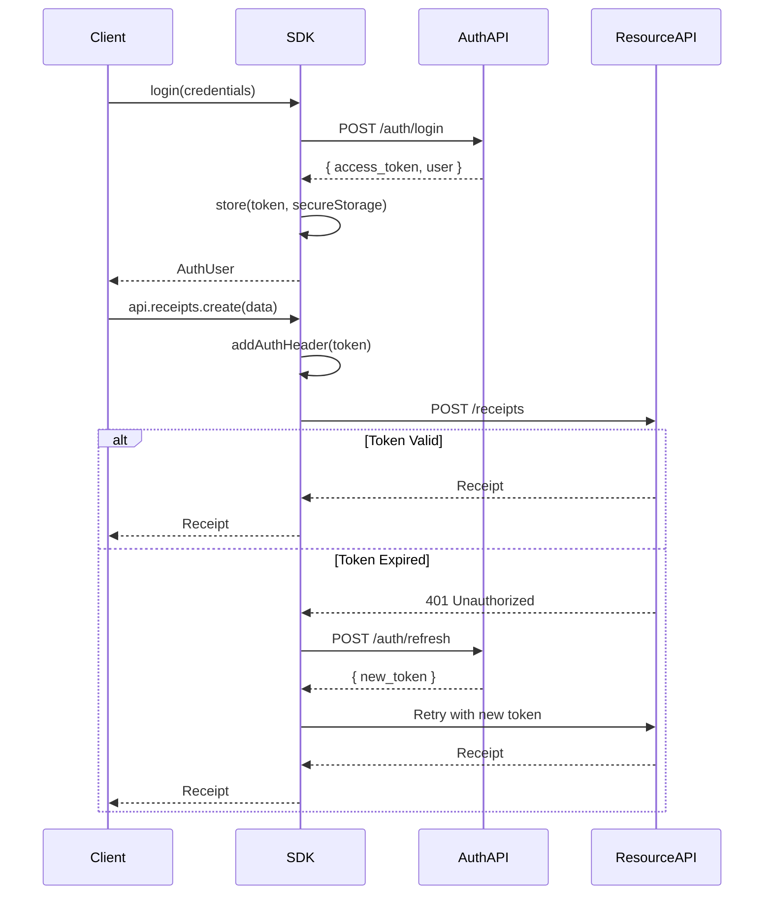
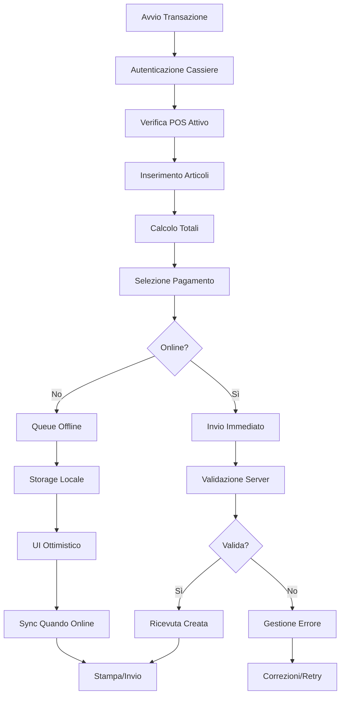

# ACube E-Receipt SDK - Core API Documentation

[](http://www.typescriptlang.org/)
[](#)

**Documentazione tecnica completa per il modulo core/api dell'ACube E-Receipt SDK**

---

## Indice

1. [Panoramica del Core API](#panoramica-del-core-api)
2. [Architettura delle API](#architettura-delle-api)
3. [Autenticazione e Sicurezza](#autenticazione-e-sicurezza)
4. [Gestione degli Errori](#gestione-degli-errori)
5. [Risorse API](#risorse-api)
   - [ReceiptsAPI](#receiptsapi)
   - [CashiersAPI](#cashiersapi)
   - [PointOfSalesAPI](#pointofsalesapi)
   - [CashRegistersAPI](#cashregistersapi)
   - [MerchantsAPI](#merchantsapi)
   - [PemsAPI](#pemsapi)
   - [SuppliersAPI](#suppliersapi)
   - [DailyReportsAPI](#dailyreportsapi)
   - [JournalsAPI](#journalsapi)
6. [Flussi di Lavoro Comuni](#flussi-di-lavoro-comuni)
7. [Esempi Multi-Piattaforma](#esempi-multi-piattaforma)
8. [Best Practices](#best-practices)
9. [Appendice](#appendice)

---

## Panoramica del Core API

Il modulo `core/api` rappresenta il cuore dell'ACube E-Receipt SDK, fornendo un'interfaccia unificata e type-safe per interagire con tutti i servizi dell'ecosistema ACube. Progettato secondo principi enterprise, offre:

### Caratteristiche Principali

- **🏗️ Architettura Modulare**: 9 risorse API specializzate per domini specifici
- **🔒 Type Safety**: Interfacce TypeScript complete con validazione a compile-time
- **⚡ Performance**: HTTP client ottimizzato con pooling delle connessioni
- **🛡️ Resilienza**: Gestione errori avanzata con retry automatico
- **🌐 Multi-Versione**: Supporto MF1 e MF2 per compatibilità completa
- **📊 Osservabilità**: Logging strutturato e metriche integrate

### Risorse Disponibili

| Risorsa | Dominio | Metodi | Versione API | Utilizzo Principale |
|---------|---------|--------|--------------|-------------------|
| **ReceiptsAPI** | Ricevute Elettroniche | 8 | MF1 | Creazione, gestione e interrogazione ricevute |
| **CashiersAPI** | Cassieri | 5 | MF1 | Autenticazione e gestione cassieri |
| **PointOfSalesAPI** | POS/PEM | 7 | MF1 | Gestione dispositivi punto vendita |
| **CashRegistersAPI** | Registratori | 3 | MF1 | Configurazione registratori di cassa |
| **MerchantsAPI** | Commercianti | 4 | MF2 | Gestione anagrafica commercianti |
| **PemsAPI** | Dispositivi PEM | 3 | MF2 | Gestione avanzata dispositivi |
| **SuppliersAPI** | Fornitori | 5 | MF2 | Gestione anagrafica fornitori |
| **DailyReportsAPI** | Report Giornalieri | 3 | MF2 | Gestione dichiarazioni fiscali giornaliere |
| **JournalsAPI** | Registri | 3 | MF2 | Gestione e chiusura registri fiscali |

---

## Architettura delle API

### Pattern Architetturale

L'architettura del core API segue il pattern **Resource-Oriented Architecture (ROA)** con elementi di **Domain-Driven Design (DDD)**:

```typescript
┌─────────────────────┐    ┌─────────────────────┐    ┌─────────────────────┐
│   APIClient         │    │   HttpClient        │    │   Platform Layer    │
│   (API Facade)      │◄──►│   (Transport)       │◄──►│   (Adapters)        │
└─────────────────────┘    └─────────────────────┘    └─────────────────────┘
           │                          │                          │
           ▼                          ▼                          ▼
┌─────────────────────┐    ┌─────────────────────┐    ┌─────────────────────┐
│   Resource APIs     │    │   Error Handler     │    │   Auth Manager      │
│ - ReceiptsAPI       │    │ - ACubeSDKError     │    │ - Token Management  │
│ - CashiersAPI       │    │ - Retry Logic       │    │ - Session Handling  │
│ - PointOfSalesAPI   │    │ - Status Mapping    │    │ - Refresh Logic     │
│ - etc...            │    │                     │    │                     │
└─────────────────────┘    └─────────────────────┘    └─────────────────────┘
           │                          │                          │
           ▼                          ▼                          ▼
┌─────────────────────────────────────────────────────────────────────────────┐
│                        ACube E-Receipt API Services                         │
│   - ereceipts-it.acubeapi.com (MF1)                                       │
│   - common.api.acubeapi.com (MF2 + Auth)                                  │
└─────────────────────────────────────────────────────────────────────────────┘
```

### Componenti Principali

#### 1. **APIClient** - Facade Pattern
```typescript
export class APIClient {
  public readonly receipts: ReceiptsAPI;
  public readonly cashiers: CashiersAPI;
  public readonly pointOfSales: PointOfSalesAPI;
  public readonly cashRegisters: CashRegistersAPI;
  public readonly merchants: MerchantsAPI;
  public readonly pems: PemsAPI;

  constructor(private httpClient: HttpClient) {
    // Inizializzazione lazy delle risorse
    this.receipts = new ReceiptsAPI(this.httpClient);
    this.cashiers = new CashiersAPI(this.httpClient);
    // ... altre risorse
  }

  getHttpClient(): HttpClient {
    return this.httpClient;
  }
}
```

#### 2. **HttpClient** - Transport Layer
```typescript
export class HttpClient {
  private config: HttpClientConfig;
  private axiosInstance: AxiosInstance;

  // Metodi principali con gestione errori integrata
  async get<T>(url: string, options?: RequestOptions): Promise<T>;
  async post<T>(url: string, data?: any, options?: RequestOptions): Promise<T>;
  async put<T>(url: string, data?: any, options?: RequestOptions): Promise<T>;
  async patch<T>(url: string, data?: any, options?: RequestOptions): Promise<T>;
  async delete<T>(url: string, options?: RequestOptions): Promise<T>;
  async download(url: string, options?: RequestOptions): Promise<Blob>;
}
```

#### 3. **Resource APIs** - Domain Layer
Ogni risorsa implementa il pattern **Repository** per operazioni CRUD:

```typescript
// Pattern comune per tutte le risorse
export class ResourceAPI {
  constructor(protected httpClient: HttpClient) {}
  
  // CRUD Operations
  async create(input: CreateInput): Promise<Output> { /* ... */ }
  async list(params?: QueryParams): Promise<Page<Output>> { /* ... */ }
  async get(id: string): Promise<Output> { /* ... */ }
  async update(id: string, input: UpdateInput): Promise<Output> { /* ... */ }
  async delete(id: string): Promise<void> { /* ... */ }
  
  // Domain-specific operations
  async customAction(params: ActionParams): Promise<ActionResult> { /* ... */ }
}
```

### Convenzioni di Design

#### 1. **Naming Conventions**
- **Classi**: PascalCase con suffisso `API` (es. `ReceiptsAPI`)
- **Metodi**: camelCase descrittivi (es. `createReceipt`, `listCashiers`)
- **Interfacce**: PascalCase con suffissi `Input`/`Output` (es. `ReceiptInput`)
- **Tipi**: PascalCase descrittivi (es. `CashierRole`, `ReceiptStatus`)

#### 2. **Error Handling Pattern**
```typescript
try {
  const result = await api.resource.method(params);
  return result;
} catch (error) {
  if (error instanceof ACubeSDKError) {
    // Errore specifico SDK con codice e dettagli
    console.error(`SDK Error [${error.code}]:`, error.message);
    throw error;
  }
  // Errore generico trasformato
  throw new ACubeSDKError('UNKNOWN_ERROR', 'Unexpected error', error);
}
```

#### 3. **Type Safety Pattern**
```typescript
// Input validation con TypeScript
interface ReceiptInput {
  items: ReceiptItem[];
  customer_tax_code?: string;
  cash_payment_amount?: string;
  card_payment_amount?: string;
  // Constraint: almeno uno dei payment_amount deve essere presente
}

// Enum per valori controllati
export type VatRateCode = '0' | '4' | '5' | '10' | '22';
export type ReceiptType = 'sale' | 'return' | 'void';
```

---

## Autenticazione e Sicurezza

### Modello di Autenticazione

L'SDK utilizza un sistema di autenticazione **token-based** con supporto per:

#### 1. **Flow di Autenticazione**


#### 2. **Token Management**
```typescript
// Gestione automatica dei token
export class AuthManager {
  private token: string | null = null;
  private refreshToken: string | null = null;
  private tokenExpiry: Date | null = null;

  async ensureValidToken(): Promise<string> {
    if (!this.token || this.isTokenExpired()) {
      if (this.refreshToken) {
        await this.refreshAccessToken();
      } else {
        throw new ACubeSDKError('AUTH_ERROR', 'No valid token available');
      }
    }
    return this.token!;
  }

  private isTokenExpired(): boolean {
    return this.tokenExpiry ? new Date() >= this.tokenExpiry : true;
  }
}
```

#### 3. **Autorizzazione per Risorsa**

| Risorsa | Permessi Richiesti | Scope |
|---------|-------------------|-------|
| **ReceiptsAPI** | `receipts:read`, `receipts:write` | Operazioni ricevute |
| **CashiersAPI** | `cashiers:read`, `cashiers:write` | Gestione cassieri |
| **PointOfSalesAPI** | `pos:read`, `pos:write` | Dispositivi POS |
| **MerchantsAPI** | `merchants:read`, `merchants:write` | Anagrafica commercianti |

### Sicurezza delle Comunicazioni

#### 1. **Transport Security**
- **HTTPS obbligatorio** per tutte le comunicazioni
- **Certificate pinning** per prevenire MITM attacks
- **Request signing** per integrità dei dati

#### 2. **Data Protection**
```typescript
// Configurazione sicurezza
const securityConfig = {
  enforceHttps: true,
  validateCertificates: true,
  requestSigning: true,
  sensitiveFields: ['password', 'tax_code', 'card_number'],
  logLevel: 'INFO' // No sensitive data in logs
};
```

---

## Gestione degli Errori

### Gerarchia degli Errori

```typescript
// Errore base SDK
export class ACubeSDKError extends Error {
  constructor(
    public code: ErrorCode,
    message: string,
    public originalError?: Error,
    public details?: Record<string, any>
  ) {
    super(message);
    this.name = 'ACubeSDKError';
  }
}

// Codici errore standardizzati
export type ErrorCode = 
  | 'NETWORK_ERROR'         // Problemi di connettività
  | 'AUTH_ERROR'           // Autenticazione fallita
  | 'VALIDATION_ERROR'     // Dati input non validi
  | 'PERMISSION_ERROR'     // Autorizzazione insufficiente
  | 'RATE_LIMIT_ERROR'     // Limite richieste superato
  | 'SERVER_ERROR'         // Errore interno server
  | 'NOT_FOUND_ERROR'      // Risorsa non trovata
  | 'CONFLICT_ERROR'       // Conflitto stato risorsa
  | 'UNKNOWN_ERROR';       // Errore non classificato
```

### Mappatura Codici HTTP

| Codice HTTP | Error Code | Descrizione | Azione Suggerita |
|-------------|------------|-------------|------------------|
| **400** | `VALIDATION_ERROR` | Dati richiesta non validi | Verificare parametri input |
| **401** | `AUTH_ERROR` | Token non valido/scaduto | Re-autenticare utente |
| **403** | `PERMISSION_ERROR` | Permessi insufficienti | Verificare ruoli utente |
| **404** | `NOT_FOUND_ERROR` | Risorsa non trovata | Controllare ID risorsa |
| **409** | `CONFLICT_ERROR` | Conflitto stato | Aggiornare stato locale |
| **429** | `RATE_LIMIT_ERROR` | Troppe richieste | Implementare rate limiting |
| **5xx** | `SERVER_ERROR` | Errore interno | Retry automatico |

### Strategie di Retry

```typescript
// Configurazione retry automatico
const retryConfig = {
  maxAttempts: 3,
  baseDelay: 1000,     // 1 secondo
  maxDelay: 30000,     // 30 secondi  
  backoffMultiplier: 2,
  retryableErrors: [
    'NETWORK_ERROR',
    'SERVER_ERROR', 
    'RATE_LIMIT_ERROR'
  ]
};

// Implementazione retry con backoff esponenziale
async function executeWithRetry<T>(
  operation: () => Promise<T>,
  config: RetryConfig
): Promise<T> {
  let lastError: Error;
  
  for (let attempt = 1; attempt <= config.maxAttempts; attempt++) {
    try {
      return await operation();
    } catch (error) {
      lastError = error;
      
      if (!isRetryableError(error) || attempt >= config.maxAttempts) {
        throw error;
      }
      
      const delay = Math.min(
        config.baseDelay * Math.pow(config.backoffMultiplier, attempt - 1),
        config.maxDelay
      );
      
      await sleep(delay);
    }
  }
  
  throw lastError!;
}
```

---

## Risorse API

### ReceiptsAPI

**Risorsa principale per la gestione completa del ciclo di vita delle ricevute elettroniche.**

#### Panoramica
La `ReceiptsAPI` gestisce tutte le operazioni relative alle ricevute elettroniche, dalla creazione alla consultazione, incluse operazioni speciali come storno e reso. È la risorsa più utilizzata dell'SDK e supporta operazioni offline tramite il sistema di queue.

#### Metodi Disponibili

##### 1. **create(receiptData: ReceiptInput): Promise<ReceiptOutput>**

Crea una nuova ricevuta elettronica.

**Parametri:**
```typescript
interface ReceiptInput {
  items: ReceiptItem[];                    // Array articoli (obbligatorio)
  customer_tax_code?: string;              // Codice fiscale cliente
  cash_payment_amount?: string;            // Importo pagamento contanti
  card_payment_amount?: string;            // Importo pagamento carta
  document_number?: string;                // Numero documento interno
  notes?: string;                          // Note aggiuntive
}

interface ReceiptItem {
  description: string;                     // Descrizione articolo
  unit_price: string;                      // Prezzo unitario (formato stringa)
  quantity: string;                        // Quantità (formato stringa)  
  vat_rate_code: VatRateCode;             // Codice aliquota IVA
  discount?: string;                       // Sconto applicato
  department_code?: string;                // Codice reparto
}

type VatRateCode = '0' | '4' | '5' | '10' | '22';
```

**Ritorna:**
```typescript
interface ReceiptOutput {
  uuid: string;                           // ID univoco ricevuta
  type: 'sale' | 'return' | 'void';      // Tipo operazione
  total_amount: string;                   // Importo totale
  vat_amount: string;                     // Importo IVA
  created_at: string;                     // Timestamp creazione (ISO)
  status: 'pending' | 'completed' | 'failed'; // Stato elaborazione
  document_number?: string;               // Numero documento assegnato
  fiscal_data?: {                        // Dati fiscali (se completata)
    lottery_code?: string;
    fiscal_receipt_number?: string;
    cash_register_id?: string;
  };
}
```

**Esempi:**

```typescript
// Node.js - Creazione ricevuta base
import { createACubeSDK } from '@a-cube-io/ereceipts-js-sdk';

const sdk = await createACubeSDK({
  environment: 'production'
});

await sdk.login({ email: 'user@example.com', password: 'password' });

const receipt = await sdk.api.receipts.create({
  items: [
    {
      description: 'Caffè Espresso',
      unit_price: '1.20',
      quantity: '2',
      vat_rate_code: '22'
    },
    {
      description: 'Cornetto',
      unit_price: '1.50', 
      quantity: '1',
      vat_rate_code: '10'
    }
  ],
  cash_payment_amount: '3.90',
  customer_tax_code: 'RSSMRA80A01H501U'
});

console.log(`Ricevuta creata: ${receipt.uuid}`);
console.log(`Totale: €${receipt.total_amount}`);
```

```typescript
// React - Con gestione errori e offline
import { useReceipts } from '@a-cube-io/ereceipts-js-sdk/react';

function ReceiptForm() {
  const { createReceipt, isLoading, error } = useReceipts();
  
  const handleSubmit = async (formData) => {
    try {
      const receipt = await createReceipt({
        items: formData.items,
        cash_payment_amount: formData.total,
        customer_tax_code: formData.customerTaxCode
      });
      
      // Successo - ricevuta creata o messa in coda se offline
      toast.success(`Ricevuta ${receipt.uuid} creata con successo`);
    } catch (error) {
      if (error.code === 'VALIDATION_ERROR') {
        setFieldErrors(error.details);
      } else {
        toast.error('Errore nella creazione della ricevuta');
      }
    }
  };
  
  return (
    <form onSubmit={handleSubmit}>
      {/* Form fields */}
      <button type="submit" disabled={isLoading}>
        {isLoading ? 'Creazione...' : 'Crea Ricevuta'}
      </button>
    </form>
  );
}
```

##### 2. **list(params?: ListParams): Promise<Page<ReceiptOutput>>**

Recupera un elenco paginato di ricevute.

**Parametri:**
```typescript
interface ListParams {
  page?: number;        // Numero pagina (default: 1)
  size?: number;        // Elementi per pagina (default: 20, max: 100)
  sort?: string;        // Campo ordinamento (default: 'created_at')
  order?: 'asc' | 'desc'; // Direzione ordinamento (default: 'desc')
}
```

**Ritorna:**
```typescript
interface Page<T> {
  members: T[];         // Array elementi
  total: number;        // Totale elementi
  page: number;         // Pagina corrente  
  size: number;         // Dimensione pagina
  total_pages: number;  // Totale pagine
}
```

**Esempio:**
```typescript
// Recupero ricevute con paginazione
const receipts = await sdk.api.receipts.list({
  page: 1,
  size: 50,
  sort: 'created_at',
  order: 'desc'
});

console.log(`Trovate ${receipts.total} ricevute`);
receipts.members.forEach(receipt => {
  console.log(`${receipt.uuid}: €${receipt.total_amount} - ${receipt.status}`);
});

// Paginazione automatica
async function getAllReceipts() {
  const allReceipts: ReceiptOutput[] = [];
  let page = 1;
  let hasMore = true;
  
  while (hasMore) {
    const result = await sdk.api.receipts.list({ page, size: 100 });
    allReceipts.push(...result.members);
    
    hasMore = page < result.total_pages;
    page++;
  }
  
  return allReceipts;
}
```

##### 3. **get(receiptUuid: string): Promise<ReceiptOutput>**

Recupera una ricevuta specifica tramite UUID.

**Esempio:**
```typescript
try {
  const receipt = await sdk.api.receipts.get('550e8400-e29b-41d4-a716-446655440000');
  console.log('Ricevuta trovata:', receipt);
} catch (error) {
  if (error.code === 'NOT_FOUND_ERROR') {
    console.log('Ricevuta non trovata');
  }
}
```

##### 4. **getDetails(receiptUuid: string, format?: 'json' | 'pdf'): Promise<ReceiptDetailsOutput | Blob>**

Recupera i dettagli completi di una ricevuta in formato JSON o PDF.

**Esempio:**
```typescript
// Dettagli JSON
const details = await sdk.api.receipts.getDetails(receiptUuid, 'json');
console.log('Dettagli completi:', details);

// PDF per stampa/download
const pdfBlob = await sdk.api.receipts.getDetails(receiptUuid, 'pdf');
const url = URL.createObjectURL(pdfBlob);

// Browser - apertura in nuova finestra
window.open(url, '_blank');

// Node.js - salvataggio file
import fs from 'fs';
const buffer = Buffer.from(await pdfBlob.arrayBuffer());
fs.writeFileSync(`ricevuta-${receiptUuid}.pdf`, buffer);
```

##### 5. **void(voidData: ReceiptReturnOrVoidViaPEMInput): Promise<void>**

Annulla (storna) una ricevuta esistente.

**Parametri:**
```typescript
interface ReceiptReturnOrVoidViaPEMInput {
  receipt_uuid: string;                   // UUID ricevuta da stornare
  pem_serial_number: string;              // Numero seriale PEM
  cashier_tax_code: string;               // Codice fiscale cassiere
  reason?: string;                        // Motivo dello storno
}
```

**Esempio:**
```typescript
// Storno ricevuta
await sdk.api.receipts.void({
  receipt_uuid: '550e8400-e29b-41d4-a716-446655440000',
  pem_serial_number: 'PEM123456789',
  cashier_tax_code: 'RSSMRA80A01H501U',
  reason: 'Errore nel prezzo'
});

console.log('Ricevuta stornata con successo');
```

##### 6. **voidWithProof(voidData: ReceiptReturnOrVoidWithProofInput): Promise<void>**

Annulla una ricevuta utilizzando la prova d'acquisto invece dell'UUID.

**Parametri:**
```typescript
interface ReceiptReturnOrVoidWithProofInput {
  proof_of_purchase: string;              // Codice prova d'acquisto
  pem_serial_number: string;              // Numero seriale PEM
  cashier_tax_code: string;               // Codice fiscale cassiere
  reason?: string;                        // Motivo dello storno
}
```

##### 7. **return(returnData: ReceiptReturnOrVoidViaPEMInput): Promise<ReceiptOutput>**

Elabora un reso per articoli di una ricevuta esistente.

**Esempio:**
```typescript
// Reso articoli
const returnReceipt = await sdk.api.receipts.return({
  receipt_uuid: '550e8400-e29b-41d4-a716-446655440000',
  pem_serial_number: 'PEM123456789', 
  cashier_tax_code: 'RSSMRA80A01H501U',
  reason: 'Prodotto difettoso'
});

console.log(`Ricevuta di reso creata: ${returnReceipt.uuid}`);
```

##### 8. **returnWithProof(returnData: ReceiptReturnOrVoidWithProofInput): Promise<ReceiptOutput>**

Elabora un reso utilizzando la prova d'acquisto.

#### Best Practices per ReceiptsAPI

##### 1. **Validazione Input**
```typescript
// Validazione lato client prima dell'invio
function validateReceiptInput(input: ReceiptInput): string[] {
  const errors: string[] = [];
  
  if (!input.items || input.items.length === 0) {
    errors.push('Almeno un articolo è obbligatorio');
  }
  
  const totalCash = parseFloat(input.cash_payment_amount || '0');
  const totalCard = parseFloat(input.card_payment_amount || '0');
  
  if (totalCash + totalCard === 0) {
    errors.push('Almeno un metodo di pagamento è obbligatorio');
  }
  
  input.items.forEach((item, index) => {
    if (parseFloat(item.unit_price) <= 0) {
      errors.push(`Prezzo articolo ${index + 1} deve essere maggiore di 0`);
    }
    if (parseFloat(item.quantity) <= 0) {
      errors.push(`Quantità articolo ${index + 1} deve essere maggiore di 0`);
    }
  });
  
  return errors;
}
```

##### 2. **Gestione Offline**
```typescript
// Pattern per operazioni offline
async function createReceiptOfflineAware(receiptData: ReceiptInput) {
  if (sdk.isOnline()) {
    // Online - creazione immediata
    return await sdk.api.receipts.create(receiptData);
  } else {
    // Offline - aggiunta alla queue
    const operationId = await sdk.getOfflineManager().queueReceiptCreation(receiptData);
    
    // Creazione ricevuta temporanea per UI ottimistico
    return {
      uuid: operationId,
      type: 'sale' as const,
      total_amount: calculateTotal(receiptData.items),
      status: 'pending' as const,
      created_at: new Date().toISOString()
    };
  }
}
```

##### 3. **Caching Strategico**
```typescript
// Cache per ricevute consultate di recente
class ReceiptCache {
  private cache = new Map<string, { data: ReceiptOutput; expires: number }>();
  private readonly TTL = 5 * 60 * 1000; // 5 minuti
  
  get(uuid: string): ReceiptOutput | null {
    const cached = this.cache.get(uuid);
    
    if (cached && Date.now() < cached.expires) {
      return cached.data;
    }
    
    this.cache.delete(uuid);
    return null;
  }
  
  set(uuid: string, receipt: ReceiptOutput): void {
    this.cache.set(uuid, {
      data: receipt,
      expires: Date.now() + this.TTL
    });
  }
}
```

---

### CashiersAPI

**Gestione completa dei cassieri, inclusa autenticazione e configurazione ruoli.**

#### Panoramica
La `CashiersAPI` gestisce tutti gli aspetti relativi ai cassieri: dalla creazione e autenticazione alla gestione dei ruoli e permessi. È fondamentale per la sicurezza e tracciabilità delle operazioni.

#### Metodi Disponibili

##### 1. **create(cashierData: CashierInput): Promise<CashierOutput>**

Crea un nuovo cassiere nel sistema.

**Parametri:**
```typescript
interface CashierInput {
  tax_code: string;                       // Codice fiscale (univoco)
  name: string;                           // Nome cassiere
  surname: string;                        // Cognome cassiere
  username: string;                       // Username per login
  password: string;                       // Password (min 8 caratteri)
  role: CashierRole;                      // Ruolo assegnato
  email?: string;                         // Email di contatto
  phone?: string;                         // Telefono di contatto
  active?: boolean;                       // Stato attivo (default: true)
}

type CashierRole = 'cashier' | 'supervisor' | 'manager' | 'admin';
```

**Ritorna:**
```typescript
interface CashierOutput {
  uuid: string;                           // ID univoco cassiere
  tax_code: string;                       // Codice fiscale
  name: string;                           // Nome
  surname: string;                        // Cognome  
  username: string;                       // Username
  role: CashierRole;                      // Ruolo
  email?: string;                         // Email
  phone?: string;                         // Telefono
  active: boolean;                        // Stato attivo
  created_at: string;                     // Data creazione
  last_login?: string;                    // Ultimo accesso
}
```

**Esempio:**
```typescript
// Creazione nuovo cassiere
const newCashier = await sdk.api.cashiers.create({
  tax_code: 'RSSMRA80A01H501U',
  name: 'Mario',
  surname: 'Rossi', 
  username: 'mario.rossi',
  password: 'SecurePass123!',
  role: 'cashier',
  email: 'mario.rossi@negozio.it',
  active: true
});

console.log(`Cassiere creato: ${newCashier.uuid}`);
```

##### 2. **authenticate(credentials: CashierCredentials): Promise<CashierAuthResult>**

Autentica un cassiere e restituisce token di sessione.

**Parametri:**
```typescript
interface CashierCredentials {
  username: string;                       // Username cassiere
  password: string;                       // Password cassiere
  pem_serial_number?: string;             // PEM associato (opzionale)
}
```

**Ritorna:**
```typescript
interface CashierAuthResult {
  cashier: CashierOutput;                 // Dati cassiere
  session_token: string;                  // Token di sessione
  expires_at: string;                     // Scadenza token
  permissions: string[];                  // Permessi associati al ruolo
}
```

**Esempio:**
```typescript
// Autenticazione cassiere
try {
  const authResult = await sdk.api.cashiers.authenticate({
    username: 'mario.rossi',
    password: 'SecurePass123!',
    pem_serial_number: 'PEM123456789'
  });
  
  console.log(`Benvenuto ${authResult.cashier.name}!`);
  console.log(`Sessione valida fino a: ${authResult.expires_at}`);
  console.log(`Permessi: ${authResult.permissions.join(', ')}`);
  
  // Salvataggio token per operazioni successive
  sessionStorage.setItem('cashier_token', authResult.session_token);
  
} catch (error) {
  if (error.code === 'AUTH_ERROR') {
    console.error('Credenziali non valide');
  }
}
```

##### 3. **list(params?: CashierListParams): Promise<Page<CashierOutput>>**

Recupera elenco paginato dei cassieri.

**Parametri:**
```typescript
interface CashierListParams {
  page?: number;                          // Numero pagina
  size?: number;                          // Elementi per pagina
  role?: CashierRole;                     // Filtro per ruolo
  active?: boolean;                       // Filtro per stato attivo
  search?: string;                        // Ricerca per nome/cognome/username
}
```

**Esempio:**
```typescript
// Lista cassieri attivi
const activeCashiers = await sdk.api.cashiers.list({
  active: true,
  role: 'cashier',
  size: 50
});

console.log(`Cassieri attivi: ${activeCashiers.total}`);
activeCashiers.members.forEach(cashier => {
  console.log(`${cashier.name} ${cashier.surname} (${cashier.username})`);
});

// Ricerca cassieri
const searchResults = await sdk.api.cashiers.list({
  search: 'mario',
  active: true
});
```

##### 4. **get(cashierUuid: string): Promise<CashierOutput>**

Recupera dettagli di un cassiere specifico.

##### 5. **update(cashierUuid: string, updateData: CashierUpdateInput): Promise<CashierOutput>**

Aggiorna i dati di un cassiere esistente.

**Parametri:**
```typescript
interface CashierUpdateInput {
  name?: string;                          // Nome (opzionale)
  surname?: string;                       // Cognome (opzionale)
  email?: string;                         // Email (opzionale)
  phone?: string;                         // Telefono (opzionale)
  role?: CashierRole;                     // Ruolo (opzionale)
  active?: boolean;                       // Stato attivo (opzionale)
  password?: string;                      // Nuova password (opzionale)
}
```

**Esempio:**
```typescript
// Aggiornamento ruolo cassiere
const updatedCashier = await sdk.api.cashiers.update(cashierUuid, {
  role: 'supervisor',
  email: 'mario.rossi.supervisor@negozio.it'
});

// Disattivazione cassiere
await sdk.api.cashiers.update(cashierUuid, {
  active: false
});
```

#### Gestione Ruoli e Permessi

```typescript
// Mappa ruoli e permessi
const ROLE_PERMISSIONS = {
  cashier: [
    'receipts:create',
    'receipts:read',
    'receipts:return'
  ],
  supervisor: [
    'receipts:create',
    'receipts:read', 
    'receipts:return',
    'receipts:void',
    'cashiers:read'
  ],
  manager: [
    'receipts:*',
    'cashiers:read',
    'cashiers:update',
    'pos:read',
    'cash_registers:read'
  ],
  admin: ['*'] // Tutti i permessi
};

// Controllo permessi
function hasPermission(cashier: CashierOutput, permission: string): boolean {
  const rolePermissions = ROLE_PERMISSIONS[cashier.role];
  
  return rolePermissions.includes('*') || 
         rolePermissions.includes(permission) ||
         rolePermissions.some(p => p.endsWith(':*') && permission.startsWith(p.slice(0, -1)));
}
```

---

### PointOfSalesAPI

**Gestione completa dei dispositivi punto vendita (PEM) e delle loro configurazioni.**

#### Panoramica
La `PointOfSalesAPI` gestisce tutti i dispositivi PEM (Point of Electronic Sale) collegati al sistema, incluse configurazioni, stato operativo e diagnostica.

#### Metodi Disponibili

##### 1. **list(params?: POSListParams): Promise<Page<PointOfSaleOutput>>**

Recupera elenco dei dispositivi POS/PEM.

**Parametri:**
```typescript
interface POSListParams {
  page?: number;
  size?: number;
  status?: 'active' | 'inactive' | 'maintenance';
  location?: string;                      // Filtro per località
}
```

**Esempio:**
```typescript
// Lista tutti i POS attivi
const activePos = await sdk.api.pointOfSales.list({
  status: 'active',
  size: 100
});

activePos.members.forEach(pos => {
  console.log(`POS ${pos.serial_number}: ${pos.status} - ${pos.location}`);
});
```

##### 2. **get(posUuid: string): Promise<PointOfSaleOutput>**
##### 3. **create(posData: PointOfSaleInput): Promise<PointOfSaleOutput>**
##### 4. **update(posUuid: string, updateData: PointOfSaleUpdateInput): Promise<PointOfSaleOutput>**
##### 5. **delete(posUuid: string): Promise<void>**
##### 6. **getStatus(posUuid: string): Promise<POSStatusOutput>**
##### 7. **updateConfiguration(posUuid: string, config: POSConfigInput): Promise<void>**

---

### CashRegistersAPI

**Gestione dei registratori di cassa e delle loro configurazioni fiscali.**

#### Metodi Disponibili

##### 1. **list(params?: CashRegisterListParams): Promise<Page<CashRegisterOutput>>**
##### 2. **get(registerId: string): Promise<CashRegisterOutput>** 
##### 3. **create(registerData: CashRegisterInput): Promise<CashRegisterOutput>**

---

### MerchantsAPI

**Gestione anagrafica commercianti (API MF2).**

#### Metodi Disponibili

##### 1. **list(params?: MerchantListParams): Promise<Page<MerchantOutput>>**
##### 2. **get(merchantId: string): Promise<MerchantOutput>**
##### 3. **create(merchantData: MerchantInput): Promise<MerchantOutput>**
##### 4. **update(merchantId: string, updateData: MerchantUpdateInput): Promise<MerchantOutput>**

---

### PemsAPI

**Gestione avanzata dispositivi PEM (API MF2).**

#### Metodi Disponibili

##### 1. **create(pemData: PemCreateInput): Promise<PemCreateOutput>**
##### 2. **get(serialNumber: string): Promise<PointOfSaleDetailedOutput>**
##### 3. **getCertificates(serialNumber: string): Promise<PemCertificatesOutput>**

---

### SuppliersAPI

**Gestione anagrafica fornitori (API MF2).**

#### Metodi Disponibili

##### 1. **list(params: SuppliersParams): Promise<SupplierOutput[]>**
##### 2. **create(supplierData: SupplierCreateInput): Promise<SupplierOutput>**
##### 3. **get(uuid: string): Promise<SupplierOutput>**
##### 4. **update(uuid: string, updateData: SupplierUpdateInput): Promise<SupplierOutput>**
##### 5. **delete(uuid: string): Promise<void>**

#### Esempio di Utilizzo
```typescript
// Creazione fornitore con validazione
const newSupplier = await sdk.api.suppliers.create({
  fiscal_id: '12345678901', // Partita IVA
  name: 'Fornitore Esempio S.r.l.',
  address: {
    street_address: 'Via Example',
    street_number: '123',
    zip_code: '00100',
    city: 'Roma',
    province: 'RM'
  }
});
```

---

### DailyReportsAPI

**Gestione dichiarazioni fiscali giornaliere (API MF2).**

#### Metodi Disponibili

##### 1. **list(params?: DailyReportsParams): Promise<DailyReportOutput[]>**
##### 2. **get(uuid: string): Promise<DailyReportOutput>**  
##### 3. **regenerate(uuid: string): Promise<DailyReportOutput>**

#### Esempio di Utilizzo
```typescript
// Recupero report con filtri
const pendingReports = await sdk.api.dailyReports.list({
  pem_serial_number: 'PEM123456',
  status: 'pending',
  date_from: '2024-01-01',
  date_to: '2024-01-31'
});

// Rigenerazione report fallito
const regenerated = await sdk.api.dailyReports.regenerate(reportUuid);
```

---

### JournalsAPI

**Gestione e chiusura registri fiscali (API MF2).**

#### Metodi Disponibili

##### 1. **list(params?: JournalsParams): Promise<JournalOutput[]>**
##### 2. **get(uuid: string): Promise<JournalOutput>**
##### 3. **close(uuid: string, closeData: JournalCloseInput): Promise<JournalOutput>**

#### Esempio di Utilizzo
```typescript
// Chiusura registro fiscale
const closedJournal = await sdk.api.journals.close(journalUuid, {
  closing_timestamp: new Date().toISOString(),
  reason: 'Chiusura fine giornata lavorativa'
});

// Recupero registri aperti
const openJournals = await sdk.api.journals.list({
  status: 'open',
  pem_serial_number: 'PEM123456'
});
```

---

## Flussi di Lavoro Comuni

### 1. Flusso Completo Creazione Ricevuta



### 2. Gestione Sessione Cassiere

```typescript
// Pattern completo gestione sessione
class CashierSessionManager {
  private session: CashierAuthResult | null = null;
  private refreshTimer?: NodeJS.Timeout;
  
  async login(credentials: CashierCredentials) {
    try {
      this.session = await sdk.api.cashiers.authenticate(credentials);
      this.setupAutoRefresh();
      
      // Eventi di sessione
      this.emit('session:started', this.session.cashier);
      
      return this.session;
    } catch (error) {
      this.emit('session:failed', error);
      throw error;
    }
  }
  
  private setupAutoRefresh() {
    if (!this.session) return;
    
    const expiresIn = new Date(this.session.expires_at).getTime() - Date.now();
    const refreshIn = expiresIn - (5 * 60 * 1000); // 5 minuti prima
    
    this.refreshTimer = setTimeout(() => {
      this.refreshSession();
    }, refreshIn);
  }
  
  private async refreshSession() {
    if (!this.session) return;
    
    try {
      // Refresh della sessione
      const newSession = await sdk.api.cashiers.authenticate({
        username: this.session.cashier.username,
        // Token refresh invece di password se supportato
      });
      
      this.session = newSession;
      this.setupAutoRefresh();
      
    } catch (error) {
      this.emit('session:expired');
      this.logout();
    }
  }
  
  logout() {
    if (this.refreshTimer) {
      clearTimeout(this.refreshTimer);
    }
    
    this.session = null;
    this.emit('session:ended');
  }
  
  getCurrentCashier() {
    return this.session?.cashier || null;
  }
  
  hasPermission(permission: string): boolean {
    return this.session?.permissions.includes(permission) || false;
  }
}
```

---

## Esempi Multi-Piattaforma

### Node.js - Server/CLI

```typescript
// server-example.ts
import { createACubeSDK } from '@a-cube-io/ereceipts-js-sdk';
import express from 'express';

const app = express();
app.use(express.json());

// Inizializzazione SDK
const sdk = await createACubeSDK({
  environment: 'production'
});

// Middleware autenticazione
async function authenticateRequest(req, res, next) {
  const { username, password } = req.headers;
  
  try {
    await sdk.login({ email: username, password });
    next();
  } catch (error) {
    res.status(401).json({ error: 'Authentication failed' });
  }
}

// Endpoint creazione ricevuta
app.post('/api/receipts', authenticateRequest, async (req, res) => {
  try {
    const receipt = await sdk.api.receipts.create(req.body);
    res.json(receipt);
  } catch (error) {
    res.status(400).json({ 
      error: error.message,
      code: error.code 
    });
  }
});

// CLI per gestione cassieri
async function createCashierCLI() {
  const readline = require('readline');
  const rl = readline.createInterface({
    input: process.stdin,
    output: process.stdout
  });
  
  const name = await question('Nome cassiere: ');
  const surname = await question('Cognome cassiere: ');
  const username = await question('Username: ');
  const password = await question('Password: ');
  
  try {
    const cashier = await sdk.api.cashiers.create({
      tax_code: generateTaxCode(name, surname),
      name,
      surname,
      username,
      password,
      role: 'cashier'
    });
    
    console.log(`✅ Cassiere creato: ${cashier.uuid}`);
  } catch (error) {
    console.error(`❌ Errore: ${error.message}`);
  }
  
  rl.close();
}
```

### Web/PWA

```typescript
// web-pos-app.ts
import { createACubeSDK } from '@a-cube-io/ereceipts-js-sdk';

class WebPOSApp {
  private sdk: ACubeSDK;
  private currentCashier: CashierOutput | null = null;
  
  async initialize() {
    this.sdk = await createACubeSDK({
      environment: 'production'
    });
    
    // Service Worker per offline
    if ('serviceWorker' in navigator) {
      navigator.serviceWorker.register('/sw.js');
    }
    
    // Gestione eventi offline
    window.addEventListener('online', () => {
      this.syncOfflineOperations();
    });
    
    window.addEventListener('offline', () => {
      this.showOfflineMode();
    });
  }
  
  async cashierLogin(credentials: CashierCredentials) {
    try {
      const authResult = await this.sdk.api.cashiers.authenticate(credentials);
      this.currentCashier = authResult.cashier;
      
      // Salvataggio sessione
      sessionStorage.setItem('cashier_session', JSON.stringify(authResult));
      
      this.showMainInterface();
      
    } catch (error) {
      this.showError('Login fallito: ' + error.message);
    }
  }
  
  async createReceipt(items: ReceiptItem[]) {
    if (!this.currentCashier) {
      throw new Error('Nessun cassiere autenticato');
    }
    
    const receiptData: ReceiptInput = {
      items,
      cash_payment_amount: this.calculateTotal(items).toString()
    };
    
    try {
      const receipt = await this.sdk.api.receipts.create(receiptData);
      this.showSuccess(`Ricevuta ${receipt.uuid} creata`);
      this.printReceipt(receipt);
      
    } catch (error) {
      if (error.code === 'NETWORK_ERROR') {
        // Modalità offline
        const operationId = await this.sdk.getOfflineManager()
          .queueReceiptCreation(receiptData);
        
        this.showInfo(`Ricevuta ${operationId} in coda per sincronizzazione`);
      } else {
        this.showError('Errore creazione ricevuta: ' + error.message);
      }
    }
  }
  
  private async syncOfflineOperations() {
    const offlineManager = this.sdk.getOfflineManager();
    const pendingCount = offlineManager.getPendingCount();
    
    if (pendingCount > 0) {
      this.showInfo(`Sincronizzazione ${pendingCount} operazioni...`);
      
      try {
        const result = await offlineManager.sync();
        this.showSuccess(`${result.successCount} operazioni sincronizzate`);
        
        if (result.failureCount > 0) {
          this.showWarning(`${result.failureCount} operazioni fallite`);
        }
      } catch (error) {
        this.showError('Errore sincronizzazione: ' + error.message);
      }
    }
  }
}

// Inizializzazione app
const app = new WebPOSApp();
app.initialize();
```

### React Native

```tsx
// react-native-pos.tsx
import React, { useState, useEffect } from 'react';
import { View, Text, Alert, FlatList } from 'react-native';
import { ACubeProvider, useAuth, useReceipts, useOffline } from '@a-cube-io/ereceipts-js-sdk/react';

const config = {
  environment: 'production' as const
};

export default function App() {
  return (
    <ACubeProvider config={config}>
      <POSScreen />
    </ACubeProvider>
  );
}

function POSScreen() {
  const { user, login, logout } = useAuth();
  const { receipts, createReceipt, isLoading } = useReceipts();
  const { isOnline, pendingCount, sync } = useOffline();
  
  const [cartItems, setCartItems] = useState<ReceiptItem[]>([]);
  
  // Effetti per gestione offline
  useEffect(() => {
    if (isOnline && pendingCount > 0) {
      Alert.alert(
        'Sincronizzazione',
        `Ci sono ${pendingCount} operazioni da sincronizzare`,
        [
          { text: 'Annulla', style: 'cancel' },
          { text: 'Sincronizza', onPress: handleSync }
        ]
      );
    }
  }, [isOnline, pendingCount]);
  
  const handleSync = async () => {
    try {
      const result = await sync();
      Alert.alert('Successo', `${result.successCount} operazioni sincronizzate`);
    } catch (error) {
      Alert.alert('Errore', 'Sincronizzazione fallita');
    }
  };
  
  const handleCreateReceipt = async () => {
    if (cartItems.length === 0) {
      Alert.alert('Errore', 'Aggiungi almeno un articolo');
      return;
    }
    
    try {
      const total = cartItems.reduce((sum, item) => 
        sum + (parseFloat(item.unit_price) * parseFloat(item.quantity)), 0
      );
      
      const receipt = await createReceipt({
        items: cartItems,
        cash_payment_amount: total.toFixed(2)
      });
      
      Alert.alert(
        'Successo', 
        isOnline 
          ? `Ricevuta ${receipt.uuid} creata`
          : 'Ricevuta in coda per sincronizzazione'
      );
      
      setCartItems([]);
      
    } catch (error) {
      Alert.alert('Errore', error.message);
    }
  };
  
  if (!user) {
    return <LoginScreen onLogin={login} />;
  }
  
  return (
    <View style={{ flex: 1, padding: 20 }}>
      {/* Status bar */}
      <View style={{ flexDirection: 'row', justifyContent: 'space-between', marginBottom: 20 }}>
        <Text>👤 {user.name}</Text>
        <Text style={{ color: isOnline ? 'green' : 'orange' }}>
          {isOnline ? '🟢 Online' : '🟡 Offline'}
        </Text>
        {pendingCount > 0 && (
          <Text style={{ color: 'orange' }}>
            📤 {pendingCount} in coda
          </Text>
        )}
      </View>
      
      {/* Cart */}
      <FlatList
        data={cartItems}
        keyExtractor={(item, index) => index.toString()}
        renderItem={({ item }) => (
          <View style={{ flexDirection: 'row', padding: 10, borderBottomWidth: 1 }}>
            <Text style={{ flex: 2 }}>{item.description}</Text>
            <Text style={{ flex: 1 }}>€{item.unit_price}</Text>
            <Text style={{ flex: 1 }}>x{item.quantity}</Text>
          </View>
        )}
      />
      
      {/* Actions */}
      <TouchableOpacity 
        onPress={handleCreateReceipt}
        disabled={isLoading}
        style={{ 
          backgroundColor: '#007AFF', 
          padding: 15, 
          borderRadius: 8,
          opacity: isLoading ? 0.6 : 1
        }}
      >
        <Text style={{ color: 'white', textAlign: 'center', fontSize: 16 }}>
          {isLoading ? 'Creazione...' : 'Crea Ricevuta'}
        </Text>
      </TouchableOpacity>
      
      <TouchableOpacity onPress={logout} style={{ marginTop: 10 }}>
        <Text style={{ textAlign: 'center', color: '#FF3B30' }}>Logout</Text>
      </TouchableOpacity>
    </View>
  );
}
```

### Expo

```tsx
// expo-pos-app.tsx
import React from 'react';
import { StatusBar } from 'expo-status-bar';
import { SafeAreaProvider } from 'react-native-safe-area-context';
import * as Notifications from 'expo-notifications';
import { ACubeProvider } from '@a-cube-io/ereceipts-js-sdk/react';

// Configurazione notifiche
Notifications.setNotificationHandler({
  handleNotification: async () => ({
    shouldShowAlert: true,
    shouldPlaySound: false,
    shouldSetBadge: false,
  }),
});

const config = {
  environment: 'production' as const
};

export default function App() {
  // Richiesta permessi notifiche
  useEffect(() => {
    (async () => {
      const { status } = await Notifications.requestPermissionsAsync();
      if (status !== 'granted') {
        Alert.alert('Avviso', 'Permessi notifiche non concessi');
      }
    })();
  }, []);
  
  return (
    <SafeAreaProvider>
      <ACubeProvider config={config}>
        <POSApp />
        <StatusBar style="auto" />
      </ACubeProvider>
    </SafeAreaProvider>
  );
}

function POSApp() {
  const { isOnline, pendingCount } = useOffline();
  
  // Notifica per operazioni sincronizzate
  const showSyncNotification = async (count: number) => {
    await Notifications.scheduleNotificationAsync({
      content: {
        title: 'Sincronizzazione completata',
        body: `${count} ricevute sincronizzate con successo`,
        data: { type: 'sync_complete' },
      },
      trigger: null,
    });
  };
  
  // Gestione notifiche offline
  useEffect(() => {
    if (!isOnline && pendingCount > 0) {
      Notifications.scheduleNotificationAsync({
        content: {
          title: 'Modalità Offline',
          body: `${pendingCount} operazioni in attesa di sincronizzazione`,
          data: { type: 'offline_queue' },
        },
        trigger: null,
      });
    }
  }, [isOnline, pendingCount]);
  
  return <MainPOSInterface />;
}
```

---

## Best Practices

### 1. Gestione degli Errori

```typescript
// Pattern standardizzato per gestione errori
class APIErrorHandler {
  static handle(error: any, context: string) {
    if (error instanceof ACubeSDKError) {
      switch (error.code) {
        case 'NETWORK_ERROR':
          return this.handleNetworkError(error, context);
        case 'AUTH_ERROR':
          return this.handleAuthError(error, context);
        case 'VALIDATION_ERROR':
          return this.handleValidationError(error, context);
        case 'RATE_LIMIT_ERROR':
          return this.handleRateLimitError(error, context);
        default:
          return this.handleGenericError(error, context);
      }
    }
    
    // Errore non SDK
    console.error(`Unexpected error in ${context}:`, error);
    return new ACubeSDKError('UNKNOWN_ERROR', 'Errore imprevisto', error);
  }
  
  private static handleNetworkError(error: ACubeSDKError, context: string) {
    // Log per debugging
    console.warn(`Network error in ${context}:`, error.message);
    
    // Messaggio user-friendly
    return {
      userMessage: 'Problemi di connessione. Riprova tra poco.',
      canRetry: true,
      suggestedDelay: 5000
    };
  }
  
  private static handleAuthError(error: ACubeSDKError, context: string) {
    console.warn(`Auth error in ${context}:`, error.message);
    
    return {
      userMessage: 'Sessione scaduta. Effettua nuovamente il login.',
      canRetry: false,
      requiresAuth: true
    };
  }
  
  private static handleValidationError(error: ACubeSDKError, context: string) {
    console.warn(`Validation error in ${context}:`, error.details);
    
    return {
      userMessage: 'Dati non validi. Controlla i campi evidenziati.',
      canRetry: true,
      fieldErrors: error.details
    };
  }
}
```

### 2. Performance e Caching

```typescript
// Sistema di cache multi-livello
class APICache {
  private memoryCache = new Map();
  private diskCache?: LocalForage; // Browser: IndexedDB, RN: AsyncStorage
  
  constructor(private ttl = 5 * 60 * 1000) { // 5 minuti default
    // Inizializzazione cache persistente
    if (typeof window !== 'undefined') {
      this.diskCache = localforage.createInstance({
        name: 'acube-api-cache'
      });
    }
  }
  
  async get<T>(key: string): Promise<T | null> {
    // Livello 1: Memoria (più veloce)
    const memCached = this.memoryCache.get(key);
    if (memCached && Date.now() < memCached.expires) {
      return memCached.data;
    }
    
    // Livello 2: Storage persistente
    if (this.diskCache) {
      const diskCached = await this.diskCache.getItem<CacheEntry<T>>(key);
      if (diskCached && Date.now() < diskCached.expires) {
        // Ripopola cache memoria
        this.memoryCache.set(key, diskCached);
        return diskCached.data;
      }
    }
    
    return null;
  }
  
  async set<T>(key: string, data: T, customTTL?: number): Promise<void> {
    const expires = Date.now() + (customTTL || this.ttl);
    const entry = { data, expires };
    
    // Salva in memoria
    this.memoryCache.set(key, entry);
    
    // Salva su disco
    if (this.diskCache) {
      await this.diskCache.setItem(key, entry);
    }
  }
  
  async invalidate(pattern: string): Promise<void> {
    // Invalidazione memoria
    for (const key of this.memoryCache.keys()) {
      if (key.includes(pattern)) {
        this.memoryCache.delete(key);
      }
    }
    
    // Invalidazione disco
    if (this.diskCache) {
      const keys = await this.diskCache.keys();
      for (const key of keys) {
        if (key.includes(pattern)) {
          await this.diskCache.removeItem(key);
        }
      }
    }
  }
}

// Utilizzo con decoratore
function cached(ttl?: number) {
  return function (target: any, propertyName: string, descriptor: PropertyDescriptor) {
    const method = descriptor.value;
    const cache = new APICache(ttl);
    
    descriptor.value = async function (...args: any[]) {
      const cacheKey = `${target.constructor.name}:${propertyName}:${JSON.stringify(args)}`;
      
      // Tentativo cache
      let result = await cache.get(cacheKey);
      if (result !== null) {
        return result;
      }
      
      // Chiamata reale
      result = await method.apply(this, args);
      
      // Salvataggio cache
      await cache.set(cacheKey, result);
      
      return result;
    };
  };
}

// Esempio utilizzo
class OptimizedReceiptsAPI extends ReceiptsAPI {
  @cached(2 * 60 * 1000) // Cache 2 minuti
  async get(receiptUuid: string): Promise<ReceiptOutput> {
    return super.get(receiptUuid);
  }
  
  @cached(30 * 1000) // Cache 30 secondi
  async list(params?: ListParams): Promise<Page<ReceiptOutput>> {
    return super.list(params);
  }
}
```

### 3. Sicurezza

```typescript
// Validazione input lato client
class InputValidator {
  static validateReceiptInput(input: ReceiptInput): ValidationResult {
    const errors: string[] = [];
    const warnings: string[] = [];
    
    // Validazione obbligatoria
    if (!input.items || input.items.length === 0) {
      errors.push('Almeno un articolo è obbligatorio');
    }
    
    // Validazione importi
    const cashAmount = parseFloat(input.cash_payment_amount || '0');
    const cardAmount = parseFloat(input.card_payment_amount || '0');
    
    if (cashAmount + cardAmount <= 0) {
      errors.push('Almeno un metodo di pagamento è obbligatorio');
    }
    
    if (cashAmount < 0 || cardAmount < 0) {
      errors.push('Gli importi di pagamento non possono essere negativi');
    }
    
    // Validazione articoli
    input.items?.forEach((item, index) => {
      const price = parseFloat(item.unit_price);
      const quantity = parseFloat(item.quantity);
      
      if (isNaN(price) || price <= 0) {
        errors.push(`Prezzo articolo ${index + 1} non valido`);
      }
      
      if (isNaN(quantity) || quantity <= 0) {
        errors.push(`Quantità articolo ${index + 1} non valida`);
      }
      
      // Controllo lunghezza descrizione
      if (item.description.length > 100) {
        warnings.push(`Descrizione articolo ${index + 1} molto lunga`);
      }
      
      // Validazione codice IVA
      const validVatCodes = ['0', '4', '5', '10', '22'];
      if (!validVatCodes.includes(item.vat_rate_code)) {
        errors.push(`Codice IVA articolo ${index + 1} non valido`);
      }
    });
    
    // Validazione codice fiscale cliente (se presente)
    if (input.customer_tax_code) {
      if (!this.isValidTaxCode(input.customer_tax_code)) {
        errors.push('Codice fiscale cliente non valido');
      }
    }
    
    return {
      isValid: errors.length === 0,
      errors,
      warnings
    };
  }
  
  private static isValidTaxCode(taxCode: string): boolean {
    // Regex per codice fiscale italiano
    const taxCodeRegex = /^[A-Z]{6}[0-9]{2}[A-Z][0-9]{2}[A-Z][0-9]{3}[A-Z]$/;
    return taxCodeRegex.test(taxCode.toUpperCase());
  }
  
  // Sanitizzazione dati sensibili per logging
  static sanitizeForLogging(data: any): any {
    const sensitive = ['password', 'tax_code', 'customer_tax_code', 'card_number'];
    
    const sanitized = JSON.parse(JSON.stringify(data));
    
    function recursiveSanitize(obj: any) {
      for (const key in obj) {
        if (sensitive.includes(key.toLowerCase())) {
          obj[key] = '***REDACTED***';
        } else if (typeof obj[key] === 'object' && obj[key] !== null) {
          recursiveSanitize(obj[key]);
        }
      }
    }
    
    recursiveSanitize(sanitized);
    return sanitized;
  }
}
```

### 4. Monitoraggio e Osservabilità

```typescript
// Sistema di metriche e monitoring
class APIMetrics {
  private metrics = new Map<string, MetricData>();
  
  trackOperation(operation: string, duration: number, success: boolean, error?: Error) {
    const key = `${operation}`;
    const existing = this.metrics.get(key) || {
      totalCalls: 0,
      totalDuration: 0,
      successCount: 0,
      errorCount: 0,
      errors: new Map()
    };
    
    existing.totalCalls++;
    existing.totalDuration += duration;
    
    if (success) {
      existing.successCount++;
    } else {
      existing.errorCount++;
      if (error) {
        const errorKey = error.message;
        existing.errors.set(errorKey, (existing.errors.get(errorKey) || 0) + 1);
      }
    }
    
    this.metrics.set(key, existing);
    
    // Alert per operazioni lente
    if (duration > 5000) { // > 5 secondi
      console.warn(`Slow operation detected: ${operation} took ${duration}ms`);
    }
    
    // Alert per alto tasso di errore
    const errorRate = existing.errorCount / existing.totalCalls;
    if (errorRate > 0.1 && existing.totalCalls > 10) { // >10% errori con almeno 10 chiamate
      console.warn(`High error rate for ${operation}: ${(errorRate * 100).toFixed(1)}%`);
    }
  }
  
  getMetrics(): OperationMetrics[] {
    return Array.from(this.metrics.entries()).map(([operation, data]) => ({
      operation,
      totalCalls: data.totalCalls,
      avgDuration: data.totalDuration / data.totalCalls,
      successRate: data.successCount / data.totalCalls,
      errorRate: data.errorCount / data.totalCalls,
      topErrors: Array.from(data.errors.entries())
        .sort(([,a], [,b]) => b - a)
        .slice(0, 5)
    }));
  }
  
  // Invio metriche a servizio di monitoring (opzionale)
  async sendToMonitoring() {
    const metrics = this.getMetrics();
    
    // Esempio integrazione con servizio esterno
    try {
      await fetch('/api/metrics', {
        method: 'POST',
        headers: { 'Content-Type': 'application/json' },
        body: JSON.stringify({
          timestamp: Date.now(),
          metrics,
          client: 'acube-sdk',
          version: '1.0.0'
        })
      });
    } catch (error) {
      console.warn('Failed to send metrics:', error);
    }
  }
}

// Decoratore per tracking automatico
function tracked(target: any, propertyName: string, descriptor: PropertyDescriptor) {
  const method = descriptor.value;
  const metrics = new APIMetrics();
  
  descriptor.value = async function (...args: any[]) {
    const start = performance.now();
    const operation = `${target.constructor.name}.${propertyName}`;
    
    try {
      const result = await method.apply(this, args);
      const duration = performance.now() - start;
      
      metrics.trackOperation(operation, duration, true);
      return result;
      
    } catch (error) {
      const duration = performance.now() - start;
      metrics.trackOperation(operation, duration, false, error);
      throw error;
    }
  };
}
```

---

## Appendice

### Interfacce Complete

```typescript
// ===== RECEIPT TYPES =====
interface ReceiptInput {
  items: ReceiptItem[];
  customer_tax_code?: string;
  cash_payment_amount?: string;
  card_payment_amount?: string;
  document_number?: string;
  notes?: string;
}

interface ReceiptItem {
  description: string;
  unit_price: string;
  quantity: string;
  vat_rate_code: VatRateCode;
  discount?: string;
  department_code?: string;
}

interface ReceiptOutput {
  uuid: string;
  type: 'sale' | 'return' | 'void';
  total_amount: string;
  vat_amount: string;
  created_at: string;
  status: 'pending' | 'completed' | 'failed';
  document_number?: string;
  fiscal_data?: {
    lottery_code?: string;
    fiscal_receipt_number?: string;
    cash_register_id?: string;
  };
}

// ===== CASHIER TYPES =====
interface CashierInput {
  tax_code: string;
  name: string;
  surname: string;
  username: string;
  password: string;
  role: CashierRole;
  email?: string;
  phone?: string;
  active?: boolean;
}

interface CashierOutput {
  uuid: string;
  tax_code: string;
  name: string;
  surname: string;
  username: string;
  role: CashierRole;
  email?: string;
  phone?: string;
  active: boolean;
  created_at: string;
  last_login?: string;
}

// ===== COMMON TYPES =====
type VatRateCode = '0' | '4' | '5' | '10' | '22';
type CashierRole = 'cashier' | 'supervisor' | 'manager' | 'admin';

interface Page<T> {
  members: T[];
  total: number;
  page: number;
  size: number;
  total_pages: number;
}

// ===== ERROR TYPES =====
type ErrorCode = 
  | 'NETWORK_ERROR'
  | 'AUTH_ERROR'
  | 'VALIDATION_ERROR'
  | 'PERMISSION_ERROR'
  | 'RATE_LIMIT_ERROR'
  | 'SERVER_ERROR'
  | 'NOT_FOUND_ERROR'
  | 'CONFLICT_ERROR'
  | 'UNKNOWN_ERROR';

interface ValidationResult {
  isValid: boolean;
  errors: string[];
  warnings: string[];
}
```

### Codici di Stato HTTP

| Codice | Significato | Gestione SDK |
|--------|-------------|-------------|
| **200** | OK | Successo, dati restituiti |
| **201** | Created | Risorsa creata con successo |
| **204** | No Content | Operazione completata, nessun dato |
| **400** | Bad Request | `VALIDATION_ERROR` con dettagli |
| **401** | Unauthorized | `AUTH_ERROR`, richiede re-login |
| **403** | Forbidden | `PERMISSION_ERROR`, permessi insufficienti |
| **404** | Not Found | `NOT_FOUND_ERROR`, risorsa inesistente |
| **409** | Conflict | `CONFLICT_ERROR`, conflitto stato |
| **429** | Too Many Requests | `RATE_LIMIT_ERROR`, retry con backoff |
| **500** | Internal Server Error | `SERVER_ERROR`, retry automatico |
| **502** | Bad Gateway | `SERVER_ERROR`, retry automatico |
| **503** | Service Unavailable | `SERVER_ERROR`, retry automatico |

### Variabili di Ambiente

```bash
# Configurazione SDK
ACUBE_ENVIRONMENT=production|sandbox|development
ACUBE_API_URL=https://ereceipts-it.acubeapi.com
ACUBE_AUTH_URL=https://common.api.acubeapi.com
ACUBE_TIMEOUT=30000
ACUBE_RETRY_ATTEMPTS=3
ACUBE_DEBUG=false

# Configurazione offline (React Native/Expo)
ACUBE_OFFLINE_ENABLED=true
ACUBE_OFFLINE_MAX_QUEUE_SIZE=1000
ACUBE_OFFLINE_SYNC_INTERVAL=30000
ACUBE_OFFLINE_MAX_RETRIES=3

# Configurazione sicurezza
ACUBE_VALIDATE_CERTIFICATES=true
ACUBE_REQUEST_SIGNING=true
ACUBE_LOG_SENSITIVE_DATA=false
```

---

**© 2024 A-Cube S.r.l. Tutti i diritti riservati.**

*Questa documentazione è per la versione 1.0.0 dell'ACube E-Receipt JavaScript SDK. Per informazioni aggiornate, consultare la documentazione ufficiale su [https://docs.acube.it](https://docs.acube.it).*